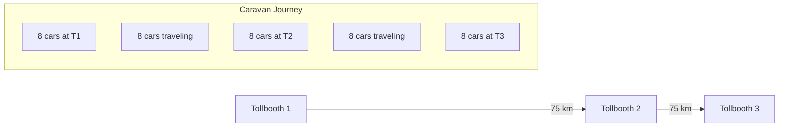
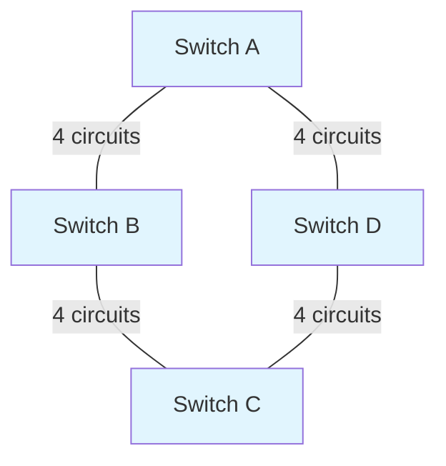
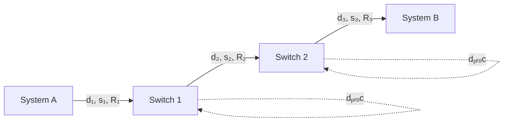

# CS 455: HW1 Introduction - Complete Solutions Guide

## Problem 1: Car-Caravan Analogy [5 pts]

**Question:** Recall the car-caravan analogy that we discussed in the class. Suppose in the caravan:
- There are eight cars in the caravan. Tollbooths are 75 km apart.
- The caravan travels 175 km/hr
- Caravan starts in front of one tollbooth, passing through a second tollbooth, and finishing just after a third tollbooth.
- A tollbooth services a car at a rate of one car every 12 seconds.

What is the End-to-End delay? (Show your calculations for full credits)

**Solution:**



**Key Insight:** This is a pipelined store-and-forward system. The total delay consists of:
- **Transmission delays**: Service time at all tollbooths
- **Propagation delays**: Travel time between tollbooths

**Calculations:**
1. **Service time per tollbooth**: 8 cars × 12 sec/car = 96 seconds
2. **Total service time**: 3 tollbooths × 96 seconds = 288 seconds
3. **Travel time between tollbooths**: 75 km ÷ 175 km/hr = 0.4286 hours = 25.71 minutes
4. **Total travel time**: 2 segments × 25.71 minutes = 51.42 minutes

**Total End-to-End Delay:**
- 288 seconds + 51.42 minutes = 4.8 minutes + 51.42 minutes = **56.22 minutes** or **56 minutes 14 seconds**

**Formula:** For N hops: Total Delay = N × (transmission time) + (N-1) × (propagation time)

---

## Problem 2: File Transfer Throughput [4 pts]

**Question:** Suppose Host A wants to send a large file to Host B. The path from Host A to Host B has three links, of rates R₁ = 500 kbps, R₂ = 2 Mbps, and R₃ = 1 Mbps.

**a) [2 pts]** Assuming no other traffic in the network, what is the throughput for the file transfer?

**b) [2 pts]** Suppose the file is 4 million bytes. What will be the maximum time taken to transfer the file from Host A to Host B?

**Solution:**


**a) Throughput Calculation:**
- Convert all rates to same units: R₁ = 500 kbps, R₂ = 2000 kbps, R₃ = 1000 kbps
- **Throughput = min{R₁, R₂, R₃} = min{500, 2000, 1000} = 500 kbps**
- The bottleneck is the first link (500 kbps)

**b) Transfer Time Calculation:**
- File size: 4 million bytes = 4 × 10⁶ bytes = 4 × 10⁶ × 8 = 32 × 10⁶ bits
- Time = File size ÷ Throughput = 32 × 10⁶ bits ÷ 500 × 10³ bits/sec = **64 seconds**

---

## Problem 3: Delay Components [4 pts]

**Question:** Consider sending a packet from a source host to a destination host over a fixed route.

**a) [2 pts]** List the delay components in the end-to-end delay.

**b) [2 pts]** Which of these delays are constant and which are variable?

**Solution:**

**a) Four Delay Components:**
1. **dₚᵣₒc**: Processing delay (nodal processing)
2. **dᵩᵤₑᵤₑ**: Queuing delay  
3. **dₜᵣₐₙₛ**: Transmission delay
4. **dₚᵣₒₚ**: Propagation delay

**Total delay formula:** d_nodal = dₚᵣₒc + dᵩᵤₑᵤₑ + dₜᵣₐₙₛ + dₚᵣₒₚ

**b) Delay Classification:**
- **Constant delays**: dₚᵣₒc, dₜᵣₐₙₛ, dₚᵣₒₚ
- **Variable delays**: dᵩᵤₑᵤₑ

**Explanation:**
- **Processing delay**: Depends on router hardware (relatively constant)
- **Transmission delay**: L/R - depends only on packet size and link rate (constant)
- **Propagation delay**: d/s - depends only on distance and medium (constant)
- **Queuing delay**: Depends on network congestion (highly variable, 0 to seconds)

---

## Problem 4: Circuit-Switched Network [6 pts]

**Question:** Consider the below circuit-switched network. There are four circuits on each link. Label the four switches A, B, C, and D, going in the clockwise direction.



**a)** What is the maximum number of simultaneous connections that can be in progress at any one time in this network?

**b)** Suppose that all connections are between switches A and C. What is the maximum number of simultaneous connections that can be in progress?

**c)** Suppose we want to make four connections between switches A and C, and another four connections between switches B and D. Can we route these calls through the four links to accommodate all eight connections?

**Solution:**

**a) Maximum Total Connections:**
- Network has 4 links, each supporting 4 circuits
- Total circuits available: 4 links × 4 circuits = 16 circuits
- **Maximum simultaneous connections: 16**

**b) A-to-C Connections Only:**
Two possible paths from A to C:
- **Path 1**: A → B → C
- **Path 2**: A → D → C

Each path can support 4 connections (limited by link capacity).
**Maximum A-to-C connections: 4 + 4 = 8**

**c) Mixed Routing (4 A-C + 4 B-D connections):**
**Yes, this is possible** with smart routing:

**Routing Strategy:**
- **A-to-C connections**: 2 via B, 2 via D
- **B-to-D connections**: 2 via A, 2 via C

**Link Utilization Check:**
- A-B link: 2 connections (A→C via B) ✓
- B-C link: 2 connections (A→C via B) + 2 connections (B→D via C) = 4 ✓
- C-D link: 2 connections (A→C via D) + 2 connections (B→D via C) = 4 ✓
- D-A link: 2 connections (A→C via D) + 2 connections (B→D via A) = 4 ✓

All links operate at exactly their 4-circuit capacity.

---

## Problem 5: Circuit vs Packet Switching [6 pts]

**Question:** Suppose users share a 2 Mbps link. Also suppose each user transmits continuously at 1 Mbps when transmitting, but each user transmits only 20 percent of the time.

**a) [2 pts]** When circuit switching is used, how many users can be supported?

**b) [2+2 pts]** Suppose packet switching is used. Why will there be essentially no queuing delay before the link if two or fewer users transmit at the same time? Why will there be a queuing delay if three users transmit at the same time?

**Solution:**

**a) Circuit Switching Capacity:**
- Link capacity: 2 Mbps
- Each user requires: 1 Mbps when active
- Since circuit switching reserves resources: **2 users maximum**
- Each user gets guaranteed 1 Mbps regardless of activity pattern

**b) Packet Switching Analysis:**

**Two or fewer users transmitting:**
- Maximum combined rate: 2 users × 1 Mbps = 2 Mbps
- Link capacity: 2 Mbps
- Since combined rate ≤ link capacity, packets can be transmitted immediately
- **No queuing delay**

**Three or more users transmitting:**
- Combined rate: 3+ users × 1 Mbps = 3+ Mbps
- Link capacity: 2 Mbps  
- Since combined rate > link capacity, packets cannot be transmitted immediately
- **Queuing delay occurs** as packets wait in buffers

**Key Insight:** Packet switching can support more users through statistical multiplexing, but experiences variable delays during congestion.

---

## Problem 6: Multiple Packet Transmission [5 pts]

**Question:** The end-to-end delay of sending one packet of length L over N links of transmission rate R is N*(L/R). Generalize this formula for sending P such packets back-to-back over the N links.

**Solution:**

```mermaid
gantt
    title Packet Pipeline Timeline
    dateFormat X
    axisFormat %s
    
    section Link 1
    Packet 1 :0, 1
    Packet 2 :1, 2
    Packet P :(P-1), P
    
    section Link N
    Packet 1 :(N-1), N
    Packet 2 :N, (N+1)
    Packet P :(P+N-2), (P+N-1)
```

**Analysis:**
- **1st packet**: Starts at time 0, arrives at destination at time N×(L/R)
- **2nd packet**: Starts at time L/R, arrives at time N×(L/R) + L/R
- **Pth packet**: Starts at time (P-1)×(L/R), takes N×(L/R) to traverse all links

**Total end-to-end delay for P packets:**
**Delay = (P-1)×(L/R) + N×(L/R) = [(P-1) + N]×(L/R)**

**Alternative form:** **(P + N - 1)×(L/R)**

**Intuition:** 
- (P-1)×(L/R): Time to send all packets from source
- N×(L/R): Time for last packet to traverse all N links

---

## Problem 7: Packet Creation and Forwarding [6 pts]

**Question:** Suppose end system A wants to send a large file to end system B.

**a) [2 pts]** At a very high level, describe how end system A creates packets from the file.

**b) [2 pts]** When one of these packets arrives to a router, what information in the packet does the router use to determine the link onto which the packet is forwarded?

**c) [2 pts]** Why is packet switching in the Internet analogous to driving from one city to another and asking directions along the way?

**Solution:**

**a) Packet Creation Process:**
1. **Application layer**: File is the original data
2. **Transport layer**: File is divided into segments, transport headers added (port numbers, sequence numbers, checksums)
3. **Network layer**: IP headers added to create packets (source/destination IP addresses, TTL, protocol type)
4. **Result**: File → Segments → Packets ready for transmission

**b) Router Forwarding Decision:**
- Router examines the **destination IP address** in the packet's network layer (IP) header
- Uses this address to consult its **forwarding table**
- Forwarding table maps destination addresses (or prefixes) to outgoing links
- Router selects appropriate output link based on longest prefix match

**c) Driving Analogy:**
- **Driver analogy**: Ask for directions at each intersection
- **Packet analogy**: Each router makes independent forwarding decisions
- **Key similarities**:
  - No complete route knowledge at start
  - Decisions made locally at each hop/intersection
  - Next hop determined based on current location and destination
  - No global path coordination required
  - Adaptive to changing conditions (traffic/network congestion)

---

## Problem 8: End-to-End Delay Analysis [9 pts]

**Question:** Consider a packet of length L that begins at end system A and travels over three links to a destination end system B. These three links are connected by two packet switches. Let dᵢ, sᵢ, and Rᵢ denote the length, propagation speed, and the transmission rate of the link i, for i = 1, 2, 3. The packet switch delays each packet by dₚᵣₒc. Assuming no queuing delays, in terms of dᵢ, sᵢ, Rᵢ, (i = 1, 2, 3), and L.



**a) [5 pts]** What is the total end-to-end delay for the packet?

**b) [2 pts]** Does packet propagation delay depend on packet length?

**c) [2 pts]** Does packet propagation delay depend on transmission rate?

**Solution:**

**a) Total End-to-End Delay:**

**Delay Components:**
- **Transmission delays**: L/R₁ + L/R₂ + L/R₃
- **Propagation delays**: d₁/s₁ + d₂/s₂ + d₃/s₃  
- **Processing delays**: 2×dₚᵣₒc (at two switches)

**Total Delay:**
**L/R₁ + L/R₂ + L/R₃ + d₁/s₁ + d₂/s₂ + d₃/s₃ + 2×dₚᵣₒc**

**b) Propagation Delay vs Packet Length:**
**No, propagation delay does NOT depend on packet length.**

**Explanation:**
- Propagation delay = dᵢ/sᵢ (distance/speed)
- Depends only on physical distance and signal propagation speed
- Independent of how much data is being transmitted
- Analogy: Time for sound to travel across a room is independent of message length

**c) Propagation Delay vs Transmission Rate:**
**No, propagation delay does NOT depend on transmission rate.**

**Explanation:**
- Propagation delay = dᵢ/sᵢ (distance/speed)
- Transmission rate Rᵢ affects how fast bits are put onto the wire (transmission delay)
- But doesn't affect how fast signals travel through the medium (propagation delay)
- Analogy: Speed of cars on highway (transmission rate) doesn't affect length of highway (propagation delay)

---

## Key Concepts Summary

1. **Store-and-Forward**: Total delay = sum of all transmission delays + sum of all propagation delays
2. **Bottleneck Links**: Throughput limited by slowest link in path
3. **Circuit vs Packet Switching**: Circuit guarantees resources but may waste them; packet switching shares resources efficiently but may cause delays
4. **Delay Components**: Processing (constant), queuing (variable), transmission (L/R), propagation (d/s)
5. **Multiple Paths**: Can increase capacity by using parallel routes
6. **Packet Pipeline**: Multiple packets can be in transit simultaneously