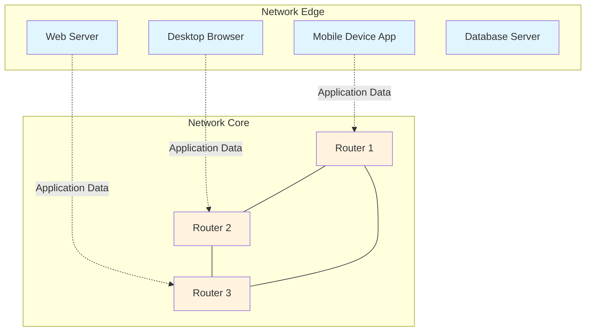
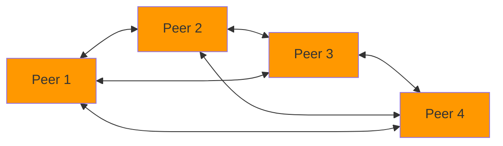
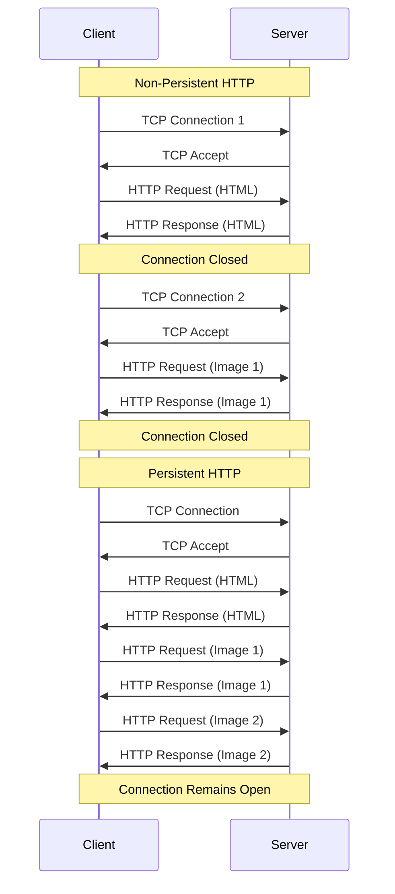
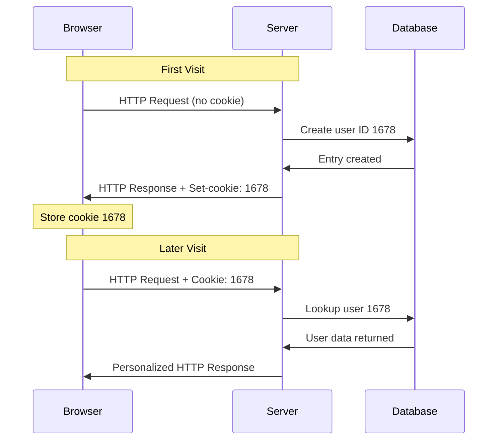
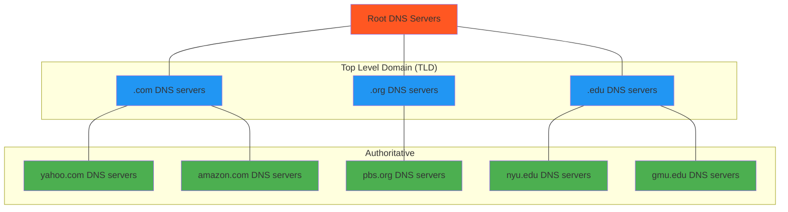

# CS-455 Application Layer Lecture Notes

## Table of Contents
1. [Application Layer Overview](#application-layer-overview)
2. [Network Application Principles](#network-application-principles)
3. [Application Architectures](#application-architectures)
4. [Processes and Communication](#processes-and-communication)
5. [Application-Layer Protocols](#application-layer-protocols)
6. [Web and HTTP](#web-and-http)
7. [HTTP Connections](#http-connections)
8. [HTTP Message Format](#http-message-format)
9. [HTTP State Management with Cookies](#http-state-management-with-cookies)
10. [Domain Name System (DNS)](#domain-name-system-dns)
11. [Key Terminology](#key-terminology)

---

## Application Layer Overview

The **Application Layer** is the topmost layer in the network protocol stack, providing network services directly to end-user applications. This chapter covers the fundamental principles of network applications and explores several key protocols and services.

### Chapter Topics Covered:
- **Principles of network applications** - Core concepts and design considerations
- **Web and HTTP** - The foundation of the World Wide Web
- **E-mail protocols** - SMTP and IMAP for electronic mail
- **Domain Name System (DNS)** - Translating human-readable names to IP addresses
- **Video streaming and content distribution networks** - Modern multimedia delivery
- **Socket programming** - Practical implementation with UDP and TCP

### Common Network Applications

Modern network applications span numerous domains and use cases:

**Communication Applications:**
- Social networking platforms
- Text messaging and instant messaging
- Voice over IP (VoIP) systems like Skype
- Real-time video conferencing
- Electronic mail systems

**Information and Entertainment:**
- Web browsing and search
- Streaming stored video (YouTube, Hulu, Netflix)
- Multi-user network games
- Remote login services

**File and Data Sharing:**
- Peer-to-peer (P2P) file sharing
- Cloud storage and synchronization
- Content distribution networks

---

## Network Application Principles

### Creating Network Applications

**Core Development Approach:**
Network applications are developed by writing programs that:
1. **Run on different end systems** - No single centralized processing point
2. **Communicate over the network** - Exchange data through network protocols
3. **Operate at network edges only** - Applications run on hosts, not in network core devices

**Example:** A web server application communicates with browser applications running on client devices.

**Key Advantage:** Since network-core devices (routers, switches) do not run user applications, this design enables:
- **Rapid application development** - No need to modify network infrastructure
- **Easy deployment and propagation** - Applications can be distributed independently
- **Network neutrality** - Core network remains application-agnostic



---

## Application Architectures

Network applications can be organized using different architectural patterns, each with distinct characteristics and trade-offs.

### Client-Server Architecture

**Server Characteristics:**
- **Always-on host** - Continuously available for client requests
- **Permanent IP address** - Fixed network location for reliable connectivity
- **Often located in data centers** - For scalability, reliability, and performance
- **Centralized resource management** - Controls access to shared resources

**Client Characteristics:**
- **Contact and communicate with server** - Initiate connections and requests
- **May be intermittently connected** - Can go online/offline as needed
- **May have dynamic IP addresses** - Often use DHCP for address assignment
- **Do not communicate directly with each other** - All communication mediated by server

**Common Examples:**
- **HTTP** - Web browsers (clients) communicate with web servers
- **IMAP** - Email clients retrieve messages from mail servers
- **FTP** - File transfer clients download from file servers

```mermaid
graph TD
    S[Server<br/>Always-on<br/>Permanent IP<br/>Data Center] 
    
    C1[Client 1<br/>Browser]
    C2[Client 2<br/>Mobile App]
    C3[Client 3<br/>Desktop App]
    
    C1 <--> S
    C2 <--> S  
    C3 <--> S
    
    C1 -.x.- C2
    C2 -.x.- C3
    C1 -.x.- C3
    
    style S fill:#4caf50
    style C1 fill:#2196f3
    style C2 fill:#2196f3
    style C3 fill:#2196f3
```

### Peer-to-Peer (P2P) Architecture

**Core Characteristics:**
- **No always-on server** - No central authority or permanent infrastructure
- **Arbitrary end systems communicate directly** - Peers interact without intermediaries
- **Dual role operation** - Each peer both requests services from and provides services to other peers

**Key Advantages:**
- **Self-scalability** - New peers bring both new service capacity and new service demands
- **Distributed resource sharing** - Leverages collective resources of all participants
- **Fault tolerance** - No single point of failure

**Challenges:**
- **Complex management** - Coordinating distributed systems is inherently difficult
- **Intermittent connectivity** - Peers frequently change IP addresses and availability
- **Security concerns** - Harder to implement centralized security controls

**Example:** P2P file sharing systems where users simultaneously download files from and upload files to other users.



---

## Processes and Communication

### Process Fundamentals

A **process** is a program running within a host system. Network communication occurs when processes running on different hosts exchange messages through the network infrastructure.

### Client and Server Processes

**Client Process:**
- **Initiates communication** - Establishes connections and sends initial requests
- **Active role** - Takes action to contact other processes
- **Often short-lived** - May terminate after completing specific tasks

**Server Process:**
- **Waits to be contacted** - Listens for incoming connection requests
- **Passive role** - Responds to client-initiated communications
- **Typically long-lived** - Runs continuously to serve multiple clients

**Important Note:** Even in P2P architectures, peer processes take on both client and server roles depending on the specific interaction context.

### Process Addressing

For processes to communicate across the network, they must be uniquely identifiable using addressing components:

**IP Address (32-bit IPv4):**
- Identifies the specific host device on the network
- Example: `129.174.134.28` for a GMU web server
- Not sufficient alone since multiple processes can run on one host

**Port Numbers (16-bit):**
- Distinguish between different processes on the same host
- Combined with IP address to create unique **socket** identifier
- **Well-known port numbers** for standard services:
  - **HTTP servers:** Port 80
  - **Mail servers:** Port 25
  - **HTTPS servers:** Port 443
  - **SSH servers:** Port 22

**Complete Process Identifier:**
To send an HTTP message to the GMU web server:
- **IP address:** `129.174.134.28`
- **Port number:** `80`
- **Socket:** `129.174.134.28:80`

---

## Application-Layer Protocols

Application-layer protocols define the rules and formats for communication between network applications.

### Protocol Definition Components

An **application-layer protocol** specifies:

**1. Types of Messages Exchanged:**
- **Request messages** - Client asks server for specific actions or data
- **Response messages** - Server replies with requested information or status
- **Notification messages** - Asynchronous updates or alerts

**2. Message Syntax:**
- **Field structure** - What information fields are included in messages
- **Field delimiters** - How fields are separated and identified
- **Encoding format** - How data is represented (ASCII, binary, etc.)

**3. Message Semantics:**
- **Field meanings** - What each piece of information represents
- **Action implications** - What should happen when specific messages are received
- **Error handling** - How to respond to invalid or unexpected messages

**4. Timing and Sequencing Rules:**
- **When to send messages** - Triggering conditions for message transmission
- **How to respond** - Required actions upon message receipt
- **Sequence requirements** - Dependencies between different messages

### Protocol Categories

**Open Protocols:**
- **Defined in RFCs** (Request for Comments) - Publicly available specifications
- **Universal access** - Anyone can implement and use these protocols
- **Examples:**
  - **HTTP** (Hypertext Transfer Protocol) - Web communication
  - **SMTP** (Simple Mail Transfer Protocol) - Email transmission
  - **FTP** (File Transfer Protocol) - File transfer operations

**Proprietary Protocols:**
- **Vendor-specific** - Controlled by individual companies
- **Limited access** - Specifications may be confidential or restricted
- **Examples:**
  - **Skype protocol** - Voice and video communication
  - **Zoom protocol** - Video conferencing
  - **Various gaming protocols** - Online multiplayer games

---

## Web and HTTP

The **World Wide Web** is a distributed information system built on top of the Internet infrastructure, using HTTP as its primary application-layer protocol.

### Web Structure and Components

**Web Page Composition:**
A web page consists of multiple **objects**, each potentially stored on different web servers:
- **Base HTML file** - Contains the main document structure and content
- **Referenced objects** - Additional resources linked from the HTML
  - **Images** - JPEG, PNG, GIF files
  - **Scripts** - JavaScript files for interactive functionality
  - **Stylesheets** - CSS files for visual formatting
  - **Media** - Audio and video files

**URL (Uniform Resource Locator) Structure:**
Each object is addressable by a unique URL with components:
```
www.someschool.edu/someDept/pic.gif
└────────┬────────┘ └─────┬──────┘
      host name        path name
```

### HTTP Protocol Overview

**HTTP (HyperText Transfer Protocol)** implements a client/server communication model:

**Client Side (Browser):**
- **Requests web objects** using HTTP protocol
- **Receives responses** containing requested content
- **Displays content** to users in formatted presentation
- **Examples:** Firefox, Chrome, Safari, mobile browsers

**Server Side (Web Server):**
- **Sends objects** in response to HTTP requests
- **Maintains web content** stored in file systems or databases
- **Examples:** Apache, Nginx, IIS servers

**Transport Protocol:**
HTTP uses **TCP (Transmission Control Protocol)** for reliable communication:

1. **Connection Establishment:**
   - Client initiates TCP connection to server on port 80
   - Server accepts the TCP connection from client
   - Creates reliable, ordered communication channel

2. **Message Exchange:**
   - HTTP messages exchanged between browser (HTTP client) and web server
   - Request/response pattern for each object transfer

3. **Connection Termination:**
   - TCP connection closed after message exchange
   - Resources released for other communications

**HTTP Statelessness:**
HTTP is fundamentally **stateless** - the server maintains no information about past client requests between transactions. This design choice provides:

**Advantages:**
- **Simplicity** - Servers don't need to track client state
- **Scalability** - No memory overhead for client sessions
- **Reliability** - No risk of corrupted state information

**Disadvantages:**
- **No persistence** - Each request must include all necessary information
- **Limited functionality** - Cannot maintain user sessions naturally

**Solution:** **Cookies** provide a mechanism to maintain state across HTTP transactions (covered in detail later).

---

## HTTP Connections

HTTP supports two distinct connection models, each with different performance characteristics and use cases.

### Non-Persistent HTTP

**Operational Model:**
1. **TCP connection opened** for each object transfer
2. **At most one object sent** over each TCP connection
3. **TCP connection closed** immediately after object transfer
4. **Multiple connections required** for downloading multiple objects

**Example Transfer Process:**
For a web page with 1 HTML file and 10 JPEG images:

1. **Initial Request:**
   - Client initiates TCP connection to server
   - Client sends HTTP request for HTML file
   - Server responds with HTML file
   - TCP connection closed

2. **Referenced Objects:**
   - Steps 1-3 repeated for each of the 10 JPEG objects
   - Total: 11 separate TCP connections required

### Persistent HTTP (HTTP 1.1)

**Enhanced Model:**
- **TCP connection opened** to server once
- **Multiple objects sent** over single TCP connection
- **Connection kept alive** after sending responses
- **Subsequent HTTP messages** between same client/server use existing connection

**Performance Benefits:**
- **Reduced connection overhead** - Eliminates repeated TCP handshakes
- **Lower latency** - No connection establishment delay for subsequent requests
- **Parallel processing** - Client can send requests immediately upon encountering referenced objects

### Performance Analysis

**Response Time Calculations:**

**Round Trip Time (RTT):** Time for a small packet to travel from client to server and back.

**Non-Persistent HTTP Response Time (per object):**
```
Total Time = 2 × RTT + File Transmission Time
```
Where:
- **First RTT:** TCP connection establishment
- **Second RTT:** HTTP request and start of response
- **File Transmission Time:** Actual data transfer duration

**Persistent HTTP with Parallel Connections:**

For a browser configured with 4 parallel connections:

**Case 1: Web page with 4 referenced objects (all on same server):**
```
Total Time = RTT(TCP connection) + RTT(HTML file) + RTT(object files) + transmission times
Total Time = 3 × RTT + file transmission times
```

**Case 2: Web page with 8 referenced objects (all on same server):**
```
Total Time = RTT(TCP connection) + RTT(HTML file) + 2 × RTT(object files) + transmission times  
Total Time = 4 × RTT + file transmission times
```

**Complex Scenario:** Multiple servers hosting different objects require separate connections to each server, increasing total RTT requirements.



---

## HTTP Message Format

HTTP messages use human-readable ASCII format with clearly defined structure for both requests and responses.

### HTTP Request Messages

**General Request Format Structure:**
```
method sp URL sp version cr lf
header field name: value cr lf
header field name: value cr lf
...
cr lf
entity body
```

Where:
- **sp** = space character
- **cr** = carriage return character (\r)
- **lf** = line feed character (\n)
- **cr lf** = end of line marker (\r\n)

**Example HTTP Request:**
```http
GET /index.html HTTP/1.1\r\n
Host: www-net.cs.umass.edu\r\n
User-Agent: Firefox/3.6.10\r\n
Accept: text/html,application/xhtml+xml\r\n
Accept-Language: en-us,en;q=0.5\r\n
Accept-Encoding: gzip,deflate\r\n
Accept-Charset: ISO-8859-1,utf-8;q=0.7\r\n
Keep-Alive: 115\r\n
Connection: keep-alive\r\n
\r\n
```

**Request Line Components:**
- **Method:** GET - specifies the HTTP method to use
- **URL:** /index.html - identifies the requested resource
- **Version:** HTTP/1.1 - indicates protocol version

**Common Header Fields:**
- **Host:** Specifies the server's domain name
- **User-Agent:** Identifies the client software
- **Accept:** Lists acceptable content types
- **Accept-Language:** Preferred languages for response
- **Connection:** Connection management preferences

### HTTP Methods

**GET Method:**
- **Purpose:** Retrieve data from server
- **Data location:** Parameters included in URL
- **Example:** `GET /search?q=networking HTTP/1.1`
- **Characteristics:** Safe, idempotent, cacheable

**POST Method:**
- **Purpose:** Submit data to server (often form input)
- **Data location:** Data included in entity body of request
- **Usage:** Web forms, file uploads, data submission
- **Characteristics:** Not safe, not idempotent

**HEAD Method:**
- **Purpose:** Request headers only (no response body)
- **Usage:** Check if resource exists, get metadata
- **Response:** Same headers as GET request would return
- **Characteristics:** Safe, idempotent

**PUT Method:**
- **Purpose:** Upload/replace file on server
- **Data location:** New content in entity body
- **Operation:** Complete replacement of resource at specified URL
- **Characteristics:** Idempotent

### HTTP Response Messages

**Response Format Structure:**
```
HTTP/1.1 200 OK\r\n
Date: Sun, 26 Sep 2010 20:09:20 GMT\r\n
Server: Apache/2.0.52 (CentOS)\r\n
Last-Modified: Tue, 30 Oct 2007 17:00:02 GMT\r\n
ETag: "17dc6-a5c-bf716880"\r\n
Accept-Ranges: bytes\r\n
Content-Length: 2652\r\n
Keep-Alive: timeout=10, max=100\r\n
Connection: Keep-Alive\r\n
Content-Type: text/html; charset=ISO-8859-1\r\n
\r\n
data data data data data...
```

**Status Line Components:**
- **Protocol version:** HTTP/1.1
- **Status code:** 200 (numeric response code)
- **Status phrase:** OK (human-readable description)

### HTTP Status Codes

**2xx Success Codes:**
- **200 OK** - Request succeeded, requested object included in response

**3xx Redirection Codes:**
- **301 Moved Permanently** - Requested object moved, new location specified in Location header

**4xx Client Error Codes:**
- **400 Bad Request** - Request message not understood by server
- **404 Not Found** - Requested document not found on server

**5xx Server Error Codes:**
- **505 HTTP Version Not Supported** - Server doesn't support HTTP version used in request

---

## HTTP State Management with Cookies

Since HTTP is stateless, **cookies** provide a mechanism for web sites and browsers to maintain state across multiple transactions.

### Cookie Implementation

**Cookie Components:**
1. **Cookie header line** in HTTP response message
2. **Cookie header line** in HTTP request message  
3. **Cookie file** kept on user's host, managed by browser
4. **Backend database** at web site for tracking user information

### Cookie Operation Example

**Initial Visit Process:**
1. **User visits e-commerce site** for first time (no existing cookies)
2. **Server creates unique ID** (e.g., 1678) for this user
3. **Server creates database entry** associating ID with user information
4. **Server sends HTTP response** with `Set-cookie: 1678` header
5. **Browser stores cookie** in local cookie file

**Subsequent Visit Process:**
1. **Browser finds cookie** for site in local file
2. **Browser includes cookie** in HTTP request: `Cookie: 1678`
3. **Server looks up ID 1678** in backend database
4. **Server provides personalized response** based on stored user information



### Cookie Applications

**Legitimate Uses:**
- **Authorization** - Maintaining login status across pages
- **Shopping carts** - Tracking items selected for purchase
- **Recommendations** - Personalizing content based on browsing history
- **User session state** - Maintaining preferences and settings

**Privacy Concerns:**
- **Behavior tracking** - Sites can learn detailed information about user activities
- **Cross-site tracking** - Third-party cookies enable tracking across multiple websites
- **User profiling** - Detailed behavioral profiles for advertising targeting

### Third-Party Cookie Tracking

**First-Party Cookies:**
- Set by the website user chose to visit
- Generally considered more acceptable
- Enable legitimate site functionality

**Third-Party Cookies:**
- Set by websites user didn't directly choose to visit
- Often embedded through advertisements or tracking pixels
- Enable cross-site behavioral tracking

**Example Tracking Scenario:**
1. **User visits nytimes.com** (sports section)
   - NYTimes sets first-party cookie: `1634`
   - Page contains AdX advertisement
   - AdX sets third-party cookie: `7493` with referrer information

2. **User visits socks.com** (next day)
   - Socks.com page contains AdX advertisement
   - Browser sends existing AdX cookie: `7493`
   - AdX correlates user's interest in sports with sock shopping
   - AdX can now serve targeted advertisements

3. **User returns to nytimes.com** (arts section)
   - AdX receives cookie `7493` with sports and shopping history
   - AdX serves targeted sock advertisement based on previous behavior

**Modern Privacy Protections:**
- **Firefox and Safari** disable third-party cookies by default
- **Chrome planned to disable** third-party cookies in 2023 (later delayed)
- **GDPR regulations** require explicit user consent for tracking cookies

### GDPR and Cookie Regulations

**GDPR (EU General Data Protection Regulation)** treats cookies as personal data when they can identify individuals:

**Key GDPR Principle:**
> "Natural persons may be associated with online identifiers [...] such as internet protocol addresses, cookie identifiers or other identifiers [...]. This may leave traces which, in particular when combined with unique identifiers and other information received by the servers, may be used to create profiles of the natural persons and identify them."

**User Rights Under GDPR:**
- **Explicit consent** required before setting tracking cookies
- **Clear information** about what data is collected and how it's used
- **Right to refuse** cookie tracking
- **Right to deletion** of personal data

---

## Domain Name System (DNS)

The **Domain Name System (DNS)** provides a critical service for translating human-readable domain names into IP addresses that computers use for network communication.

### DNS Purpose and Services

**Primary Function:**
DNS acts as the "phone book" of the Internet, mapping between:
- **Domain names** (human-readable) → **IP addresses** (machine-readable)
- **IP addresses** → **Domain names** (reverse lookup)

**Core DNS Services:**
1. **Hostname to IP address translation** - Convert www.example.com to 192.0.2.1
2. **Host aliasing** - Multiple names for same host (canonical vs. alias names)
3. **Mail server aliasing** - Separate mail server identification
4. **Load distribution** - Multiple IP addresses for replicated web servers

### Why Distributed DNS?

**Problems with Centralized DNS:**
- **Single point of failure** - One server failure affects entire Internet
- **Traffic volume** - Cannot handle billions of queries per day
- **Distant centralized database** - High latency for global users
- **Maintenance complexity** - Impossible to maintain single global database

**Distributed Solution Benefits:**
- **Fault tolerance** - Multiple servers provide redundancy
- **Load sharing** - Distributes query processing across many servers
- **Reduced latency** - Local servers provide faster responses
- **Administrative autonomy** - Organizations control their own domains

### DNS Hierarchy Structure

DNS implements a **distributed, hierarchical database** with three levels:



**1. Root DNS Servers:**
- **Top of hierarchy** - Ultimate authority for DNS system
- **13 logical root servers** worldwide (A through M)
- **Multiple physical servers** per logical server for redundancy
- **Manage top-level domains** - Know where to find .com, .org, .edu servers

**2. Top-Level Domain (TLD) Servers:**
- **Manage major domains** - .com, .org, .edu, .gov, country codes
- **Authoritative for TLD** - Know all second-level domains in their TLD
- **Examples:**
  - **.com TLD servers** know about amazon.com, google.com, etc.
  - **.edu TLD servers** know about mit.edu, stanford.edu, etc.

**3. Authoritative DNS Servers:**
- **Organization's DNS servers** - Provide authoritative answers for organization's domain
- **Maintain DNS records** - All mappings for hosts in organization
- **Can be maintained by organization** or service provider
- **Examples:** amazon.com servers know about www.amazon.com, mail.amazon.com

### DNS Resolution Process

**Example:** Client wants IP address for www.amazon.com

**Step-by-step Resolution:**
1. **Client queries root server** to find .com DNS server address
2. **Client queries .com server** to find amazon.com DNS server address  
3. **Client queries amazon.com server** to get IP address for www.amazon.com

**Actual Process More Complex:**
- **Local DNS servers** (recursive resolvers) perform queries on behalf of hosts
- **Caching mechanisms** store results to reduce query load
- **Iterative vs. recursive queries** determine who performs the work

---

## Key Terminology

**Application Layer** - The topmost layer in the network protocol stack that provides network services directly to end-user applications.

**Client Process** - A process that initiates communication by contacting and requesting services from server processes.

**Server Process** - A process that waits to be contacted and provides services in response to client requests.

**Socket** - The combination of an IP address and port number that uniquely identifies a process on a network host.

**Port Number** - A 16-bit number that distinguishes between different processes running on the same host.

**HTTP (HyperText Transfer Protocol)** - The application-layer protocol used for communication between web browsers and web servers.

**Stateless Protocol** - A protocol where the server maintains no information about past client requests between transactions.

**RTT (Round Trip Time)** - The time required for a small packet to travel from client to server and back.

**Persistent Connection** - An HTTP connection that remains open after sending a response, allowing multiple objects to be sent over the same connection.

**Non-Persistent Connection** - An HTTP connection that is closed after sending at most one object, requiring new connections for additional objects.

**Cookie** - A small piece of data stored by a web browser that allows websites to maintain state information across multiple HTTP transactions.

**First-Party Cookie** - A cookie set by the website that the user chose to visit directly.

**Third-Party Cookie** - A cookie set by a website different from the one the user chose to visit, often used for cross-site tracking.

**DNS (Domain Name System)** - A distributed database system that translates human-readable domain names into IP addresses.

**URL (Uniform Resource Locator)** - A standardized address format that specifies the location of a resource on the Internet.

**TLD (Top-Level Domain)** - The highest level of domain names in the DNS hierarchy, such as .com, .org, or .edu.

**Authoritative DNS Server** - A DNS server that provides definitive answers for DNS queries about domains under its authority.

**P2P (Peer-to-Peer)** - An application architecture where arbitrary end systems communicate directly with each other without requiring an always-on server.

**RFC (Request for Comments)** - Documents that define Internet standards and protocols, making them publicly available for implementation.

---

This completes the comprehensive study notes for the CS-455 Application Layer lecture, covering all concepts, examples, calculations, and important details from the provided slides.