# CS-455 Application Layer Part 2

## Table of Contents

1. [Local DNS Servers](#local-dns-servers)
2. [DNS Name Resolution](#dns-name-resolution)
3. [DNS Caching and Record Updates](#dns-caching-and-record-updates)
4. [DNS Records and Resource Records](#dns-records-and-resource-records)
5. [DNS Protocol Messages](#dns-protocol-messages)
6. [Web Caches (Proxy Servers)](#web-caches-proxy-servers)
7. [HTTP Evolution](#http-evolution)
8. [QUIC Protocol](#quic-protocol)
9. [Email System: SMTP](#email-system-smtp)
10. [Video Streaming and CDNs](#video-streaming-and-cdns)

---

## Local DNS Servers

**Local DNS servers** serve as intermediaries between end hosts and the DNS hierarchy. Every Internet Service Provider (ISP) - whether residential, company, or university - maintains at least one local DNS server.

### Key Functions:

- **First Contact Point**: When a host makes a DNS query, it is automatically sent to the local DNS server
- **Caching**: Maintains a local cache of recent name-to-address translation pairs for faster resolution
- **Proxy Function**: Acts as a proxy, forwarding queries into the DNS hierarchy when local cache misses occur

### Important Limitations:

- Cached entries may become **out-of-date** if the authoritative records change
- Cache entries have Time-To-Live (TTL) values that determine when they expire

---

## DNS Name Resolution

DNS name resolution can occur through two primary methods: **iterative queries** and **recursive queries**.

### Iterative Query Process

In iterative queries, the contacted server replies with the name of the next server to contact rather than performing the resolution itself.

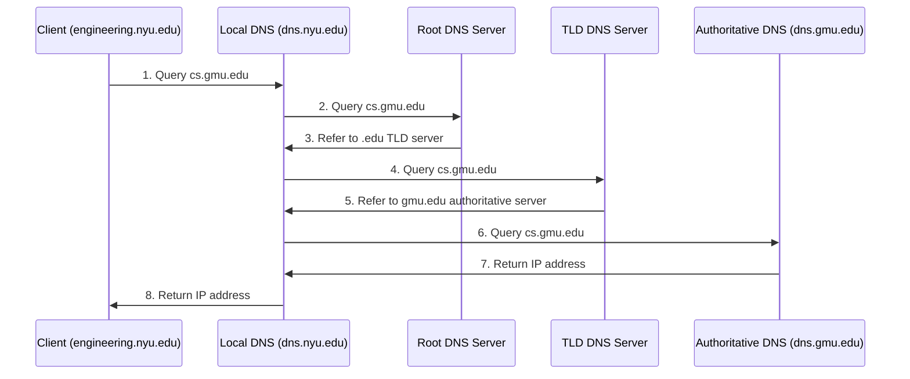

**Process Steps:**

1. Client requests IP address for cs.gmu.edu from local DNS
2. Local DNS queries root DNS server
3. Root server responds: "I don't know, but ask the .edu TLD server"
4. Local DNS queries TLD server
5. TLD server responds: "Ask the authoritative server for gmu.edu"
6. Local DNS queries authoritative server
7. Authoritative server returns the IP address
8. Local DNS returns result to client

### Recursive Query Process

In recursive queries, each server in the chain takes responsibility for completing the entire resolution process.

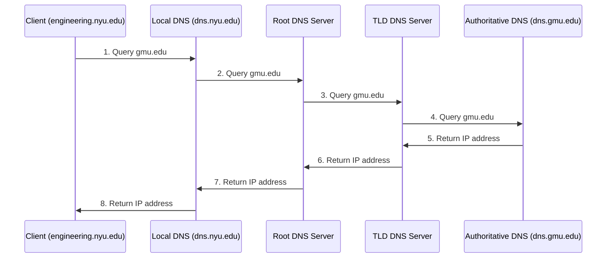

**Key Differences:**

- **Iterative**: Each server provides referrals; querying responsibility stays with local DNS
- **Recursive**: Each server takes responsibility for completing the query
- **Load Distribution**: Recursive queries place heavier computational load on upper-level DNS servers

---

## DNS Caching and Record Updates

### Caching Mechanism

- **Universal Caching**: Any name server that learns a mapping caches it for future use
- **TTL Expiration**: Cache entries disappear after their Time-To-Live expires
- **Staleness Risk**: Cached entries may become out-of-date before expiration

### Cache Hierarchy Benefits

- **TLD Server Caching**: TLD servers are typically cached in local name servers
- **Root Server Relief**: Root name servers are visited less frequently due to effective caching
- **Performance Improvement**: Significantly reduces query resolution time for repeated requests

---

## DNS Records and Resource Records

DNS operates as a distributed database storing **Resource Records (RR)** with the format: `(name, value, type, TTL)`

### DNS Record Types

#### Type A Records

- **Purpose**: Maps hostname to IP address
- **Format**: `(hostname, IP_address, A, TTL)`
- **Example**: `(dns1.networkutopia.com, 212.212.212.1, A)`

#### Type NS Records

- **Purpose**: Identifies authoritative name server for a domain
- **Format**: `(domain, authoritative_server_hostname, NS, TTL)`
- **Example**: `(name.networkutopia.com, dns1.networkutopia.com, NS)`

#### Type CNAME Records

- **Purpose**: Creates alias for canonical (real) hostname
- **Format**: `(alias_name, canonical_name, CNAME, TTL)`
- **Example**: `(networkutopia.com, name.networkutopia.com, CNAME)`

#### Type MX Records

- **Purpose**: Specifies mail server for a domain
- **Format**: `(domain, mail_server_hostname, MX, TTL)`
- **Example**: `(name.networkutopia.com, mailserver1.name.networkutopia.com, MX)`

### Example: Network Utopia Company Records

For a startup company "Network Utopia":

- **Domain Name**: networkutopia.com
- **Actual Server Name**: name.networkutopia.com
- **IP Address**: 212.212.212.1
- **Authoritative Server**: dns1.networkutopia.com
- **Mail Server**: mailserver1.name.networkutopia.com

**Complete Record Set:**

```
(networkutopia.com, name.networkutopia.com, CNAME)
(name.networkutopia.com, dns1.networkutopia.com, NS)
(dns1.networkutopia.com, 212.212.212.1, A)
(name.networkutopia.com, mailserver1.name.networkutopia.com, MX)
```

---

## DNS Protocol Messages

DNS uses a standardized message format for both queries and replies.

### Message Structure

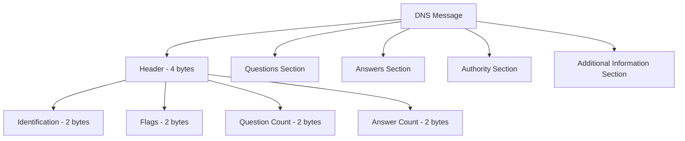

### Header Fields

**Identification Field (16 bits)**:

- Unique identifier for each query
- Reply messages use the same identification number as the corresponding query

**Flags Field**:

- **Query/Reply bit**: Indicates whether message is a query or response
- **Recursion Desired**: Client requests recursive resolution
- **Recursion Available**: Server supports recursive queries
- **Authoritative Answer**: Response comes from authoritative server

### Message Sections

1. **Questions Section**: Contains the name and type fields for queries
2. **Answers Section**: Resource Records responding to the query
3. **Authority Section**: Records for authoritative servers
4. **Additional Section**: Extra helpful information that may be useful

---

## Web Caches (Proxy Servers)

**Web caches** (also called proxy servers) serve as intermediaries between clients and origin servers to improve performance and reduce network traffic.

### Basic Operation

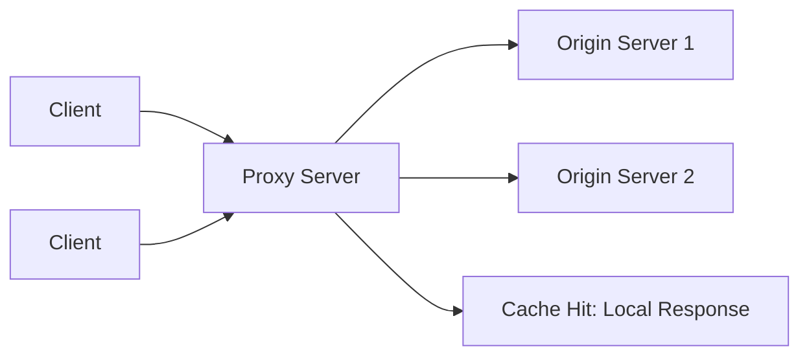

### Cache Process Flow

1. **Configuration**: User configures browser to point to web cache
2. **Request Routing**: Browser sends all HTTP requests to cache
3. **Cache Decision**:
   - **Cache Hit**: If object exists in cache, return it to client
   - **Cache Miss**: Request object from origin server, cache it, then return to client

### Benefits of Web Caching

#### Performance Improvements

- **Reduced Response Time**: Cache is typically closer to client than origin server
- **Lower Latency**: Eliminates round-trip time to distant servers
- **Bandwidth Conservation**: Reduces traffic on institution's access link

#### Deployment Locations

- **Universities**: Campus-wide caching for student access
- **Corporations**: Enterprise caching for employee traffic
- **ISPs**: Provider-level caching for subscriber traffic

---

## Caching Performance Analysis

### Scenario Parameters

- **Access Link Rate**: 1.54 Mbps
- **RTT to Server**: 2 seconds
- **Web Object Size**: 100K bits
- **Request Rate**: 15 requests/sec
- **Average Data Rate**: 1.50 Mbps
- **LAN Capacity**: 1 Gbps

### Performance Calculations

#### Without Caching

**LAN Utilization**:

```
LAN utilization = (15 requests/sec × 100K bits) / 1 Gbps
                = 1.5 Mbps / 1000 Mbps = 0.0015 = 0.15%
```

**Access Link Utilization**:

```
Access link utilization = 1.50 Mbps / 1.54 Mbps = 0.97 = 97%
```

**End-to-End Delay**: 2 sec + minutes (due to high utilization) + msecs

#### With Web Cache (40% hit rate)

**Traffic Analysis**:

- 40% of requests satisfied from cache
- 60% of requests require access link usage

**Reduced Access Link Usage**:

```
Data rate over access link = 0.6 × 1.50 Mbps = 0.9 Mbps
Access link utilization = 0.9 Mbps / 1.54 Mbps = 0.58 = 58%
```

**Average End-to-End Delay**:

```
Delay = 0.6 × (delay from origin servers) + 0.4 × (delay from cache)
```

This results in significantly lower average delay compared to the faster access link solution.

### Cost Comparison

- **Faster Access Link**: Expensive infrastructure upgrade
- **Web Cache**: Inexpensive local installation with better performance

---

## Conditional GET

**Conditional GET** optimizes caching by avoiding unnecessary object transmission when cached copies remain current.

### Protocol Mechanism

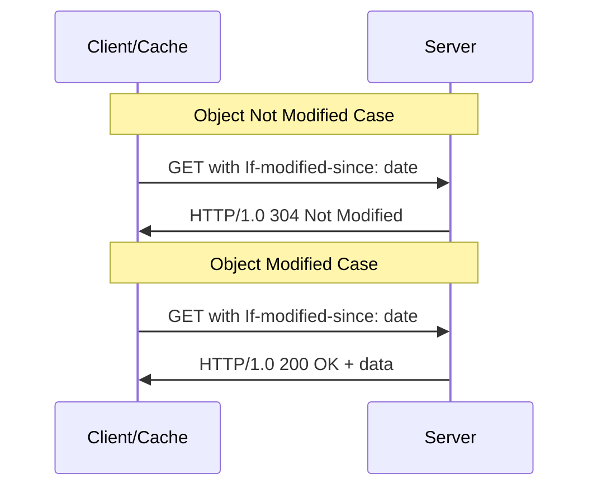

### Implementation Details

**Client Request**:

- Includes `If-modified-since: <date>` header with cached object's timestamp

**Server Response Options**:

- **304 Not Modified**: Object unchanged since specified date
- **200 OK**: Object modified, includes updated content

### Benefits

- **Bandwidth Reduction**: Eliminates transmission of unchanged objects
- **Cache Validation**: Ensures cache consistency without full downloads
- **Network Efficiency**: Reduces unnecessary data transfer

---

## HTTP Evolution

### HTTP/1.1 Improvements

**Primary Goal**: Decrease delay in multi-object HTTP requests

**Key Features**:

- **Persistent Connections**: Multiple requests over single TCP connection
- **Pipelining**: Multiple GET requests sent without waiting for responses
- **FCFS Processing**: Server responds in first-come-first-served order

**Head-of-Line (HOL) Blocking Problem**:
Small objects may wait for transmission behind large objects, creating delays.

### HTTP/2 Enhancements

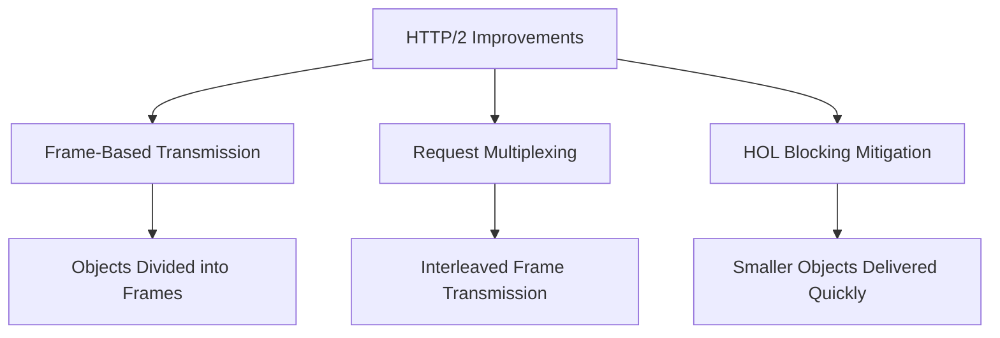

**Frame Interleaving**: Large objects divided into frames, allowing small object frames to be transmitted between large object frames.

**Result**: O2, O3, O4 delivered quickly while O1 experiences only slight delay.

### HTTP/3 Innovations

**Key Features**:

- **QUIC Protocol**: Runs over UDP instead of TCP
- **Enhanced Security**: Built-in encryption and authentication
- **Per-Object Control**: Individual error and congestion control per object
- **Improved Pipelining**: Even better parallelism than HTTP/2

---

## QUIC Protocol

**QUIC (Quick UDP Internet Connections)** represents a significant evolution in transport protocols for HTTP.

### Protocol Stack Comparison

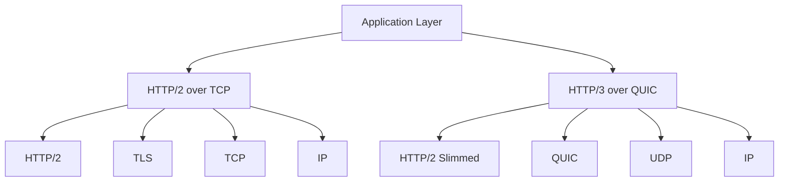

### QUIC Advantages

**Performance Benefits**:

- **Reduced Connection Establishment Time**: Combined transport and security handshake
- **Improved Multiplexing**: Better stream isolation than TCP
- **Enhanced Error Recovery**: Per-stream error handling

**Deployment**:

- Originally developed by Google
- Used in Google services (Chrome, YouTube mobile app)
- Becoming Internet standard for modern web applications

---

## Email System: SMTP

The email system consists of three major components working together to provide reliable message delivery.

### System Architecture

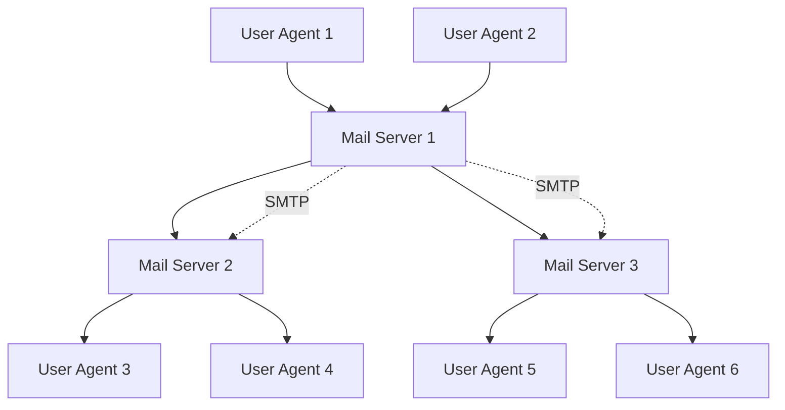

### System Components

#### User Agents

- **Function**: Mail reading and composition applications
- **Examples**: Outlook, iPhone mail client, Thunderbird
- **Capabilities**: Composing, editing, reading mail messages
- **Storage**: Outgoing and incoming messages stored on server

#### Mail Servers

- **Mailbox**: Contains incoming messages for users
- **Message Queue**: Outgoing messages waiting for transmission
- **SMTP Protocol**: Communication between mail servers

### SMTP Protocol Details

**Transport Characteristics**:

- **Protocol**: TCP for reliable message transfer
- **Port**: 25 (standard SMTP port)
- **Connection Type**: Direct transfer from sending to receiving server

**Three-Phase Operation**:

1. **Handshaking**: Initial greeting and authentication
2. **Message Transfer**: Actual email content transmission
3. **Closure**: Clean connection termination

### Email Delivery Process

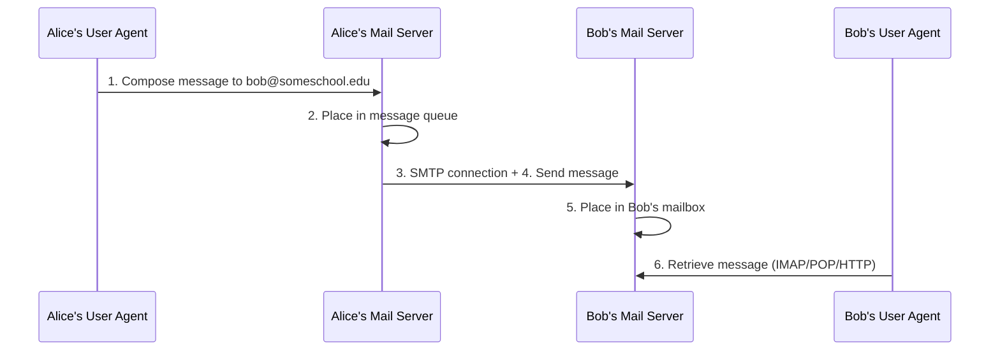

**Detailed Steps**:

1. Alice composes email using her user agent
2. Alice's mail server queues the message for delivery
3. SMTP client opens TCP connection to Bob's mail server
4. Message transmitted over SMTP connection
5. Bob's mail server places message in Bob's mailbox
6. Bob retrieves message using email access protocol

### Email Access Protocols

**SMTP**: Used for sending messages between servers
**Retrieval Protocols**:

- **IMAP (Internet Message Access Protocol)**: Server-based message management
- **POP (Post Office Protocol)**: Download-and-delete model
- **HTTP**: Web-based email interfaces

### SMTP vs HTTP Comparison


| Characteristic     | SMTP           | HTTP                                |
| -------------------- | ---------------- | ------------------------------------- |
| **Direction**      | Push protocol  | Pull protocol                       |
| **Connections**    | Persistent     | Can be persistent or non-persistent |
| **Command Format** | ASCII commands | ASCII commands                      |
| **Status Codes**   | Yes            | Yes                                 |

### Message Format (RFC 822)

**Structure**:

```
Header Lines:
To: recipient@domain.com
From: sender@domain.com
Subject: Message Subject

[Blank Line]

Body:
Message content in ASCII characters
```

**Important Distinction**:

- Header lines within message body are different from SMTP protocol commands
- SMTP commands (MAIL FROM:, RCPT TO:) are protocol-level instructions
- Message headers (To:, From:, Subject:) are part of the email content

---

## Video Streaming and CDNs

Video streaming presents unique challenges due to the large data volumes and real-time delivery requirements.

### Video Fundamentals

#### Video Composition

- **Definition**: Sequence of images displayed at constant rate (e.g., 24 frames/sec)
- **Digital Images**: Array of pixels, each represented by bits
- **Compression**: Uses spatial and temporal redundancy to reduce bit requirements

#### Compression Techniques

**Spatial Coding**:

- **Method**: Instead of sending N values of same color, send color value and repetition count
- **Example**: Purple background → send (purple, N) instead of N purple values

**Temporal Coding**:

- **Method**: Send only differences between consecutive frames
- **Benefit**: Significant reduction in data for scenes with minimal changes

#### Encoding Standards and Bit Rates

**Constant Bit Rate (CBR)**:

- Fixed encoding rate throughout video
- Predictable bandwidth requirements

**Variable Bit Rate (VBR)**:

- Encoding rate varies with spatial/temporal complexity
- More efficient compression

**Common Standards**:

- **MPEG-1 (CD-ROM)**: 1.5 Mbps
- **MPEG-2 (DVD)**: 3-6 Mbps
- **MPEG-4 (Internet)**: 64 Kbps - 12 Mbps

### Streaming Challenges

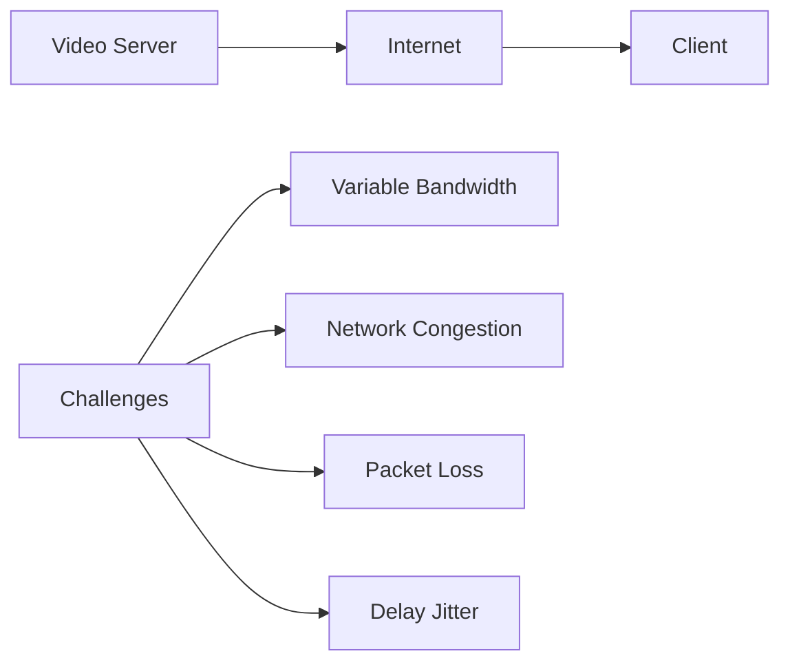

**Primary Issues**:

- **Bandwidth Variation**: Server-to-client throughput changes with network conditions
- **Packet Loss**: Lost packets delay playout or reduce quality
- **Jitter**: Variable network delays affect continuous playout
- **Continuous Playout Constraint**: Playback must match original timing

### Streaming Architecture

#### Playout Buffering

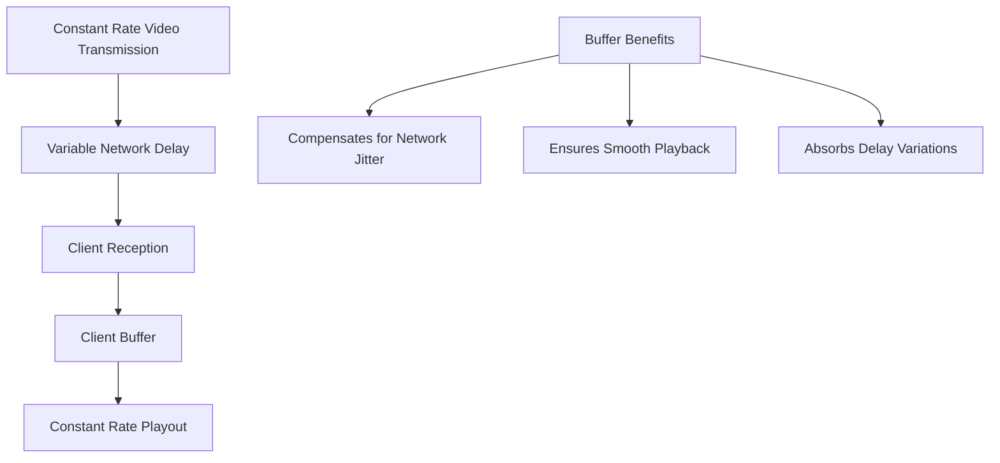

**Buffer Function**:

- Compensates for network-added delay and jitter
- Maintains constant playout rate despite variable reception
- Introduces initial playout delay for stability

### DASH (Dynamic Adaptive Streaming over HTTP)

DASH revolutionizes video streaming by providing adaptive quality based on network conditions.

#### Server Components

- **Chunked Video**: Divides video into segments (e.g., 2-10 seconds each)
- **Multiple Encodings**: Each chunk available at different bit rates/qualities
- **Manifest File**: Contains URLs for all chunk versions

#### Client Intelligence

- **Bandwidth Measurement**: Continuously monitors available throughput
- **Adaptive Selection**: Chooses appropriate quality level per chunk
- **Buffer Management**: Decides when to request next chunk

#### DASH Operation

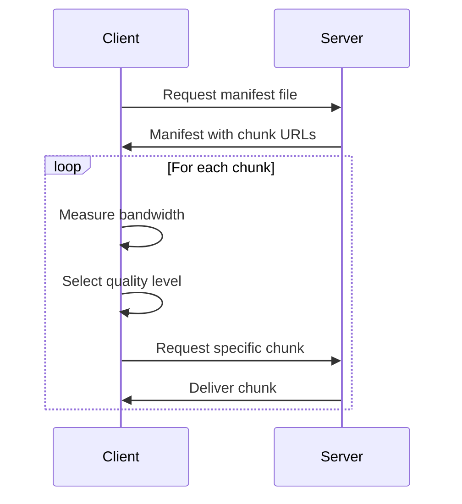

**Benefits**:

- **Quality Adaptation**: Higher quality when bandwidth allows
- **Continuous Playback**: Falls back to lower quality to avoid stalling
- **Efficiency**: Uses available bandwidth optimally

### Content Distribution Networks (CDNs)

CDNs solve the scalability problem of video delivery by distributing content geographically.

#### CDN Architecture

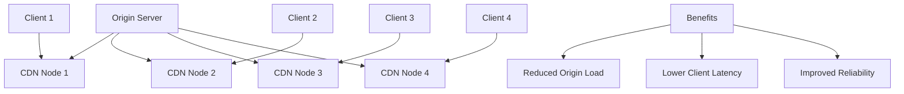

#### CDN Content Access Process

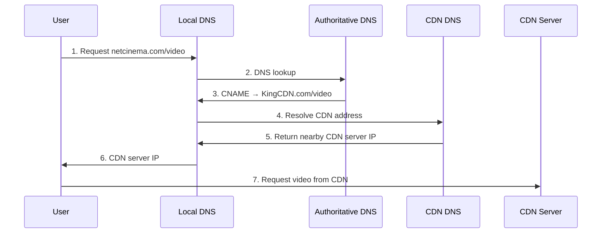

**Process Steps**:

1. User requests video from content provider
2. DNS resolution returns CNAME pointing to CDN
3. CDN's DNS system selects nearby server
4. Client receives CDN server address
5. Video streaming begins from CDN server

### Case Study: Netflix Architecture

Netflix demonstrates sophisticated integration of multiple technologies for global video delivery.

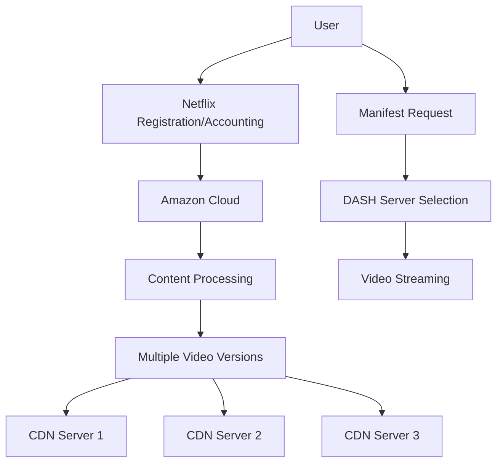

**Netflix Process Flow**:

1. **Account Management**: User registration and authentication via Amazon cloud
2. **Content Browsing**: User selects video content
3. **Manifest Delivery**: Server provides DASH manifest with available versions
4. **CDN Selection**: System selects optimal CDN server for user
5. **Adaptive Streaming**: DASH protocol provides quality adaptation during playback

**Key Technologies Integration**:

- **Cloud Infrastructure**: Amazon Web Services for scalability
- **CDN Distribution**: Global content delivery network
- **DASH Streaming**: Adaptive bitrate streaming
- **Content Preparation**: Multiple encoding versions for different devices/bandwidths

---

## Key Terminology

**DNS (Domain Name System)**: Distributed database system that translates human-readable domain names to IP addresses

**Local DNS Server**: ISP-provided DNS server that acts as first contact point for client DNS queries

**Resource Record (RR)**: Basic data structure in DNS containing name, value, type, and TTL information

**TTL (Time To Live)**: Duration for which DNS records can be cached before requiring refresh

**Web Cache/Proxy Server**: Intermediate server that stores copies of web objects to reduce access time and network traffic

**SMTP (Simple Mail Transfer Protocol)**: Protocol for reliable email transmission between mail servers

**User Agent**: Email client application for composing, reading, and managing email messages

**CDR/VBR**: Constant/Variable Bit Rate encoding schemes for video compression

**DASH**: Dynamic Adaptive Streaming over HTTP protocol for adaptive video quality delivery

**CDN (Content Distribution Network)**: Geographically distributed servers that cache and deliver content closer to end users

**QUIC**: Modern transport protocol running over UDP, designed for improved web performance and security
