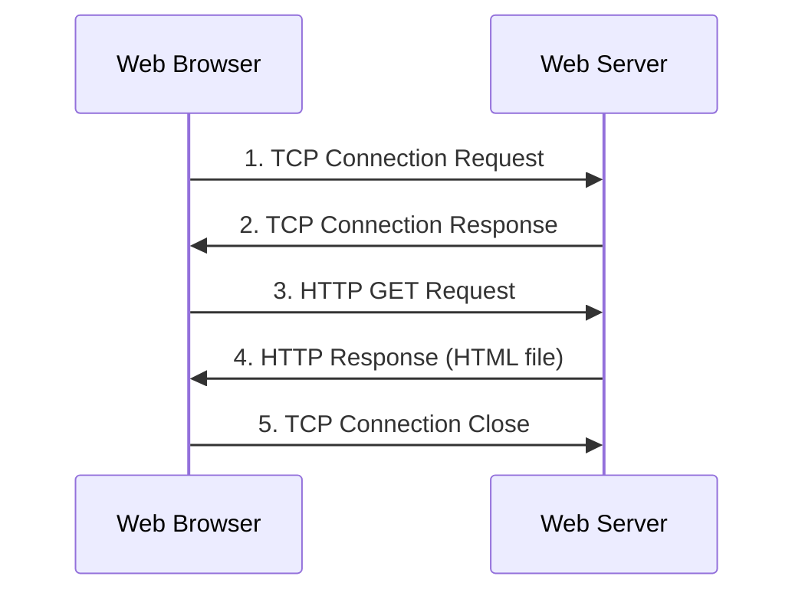
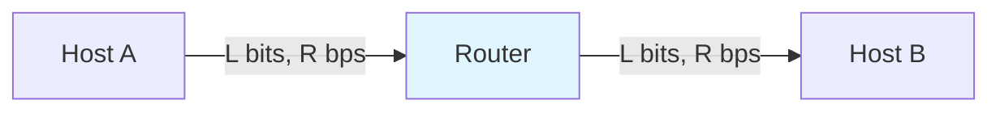
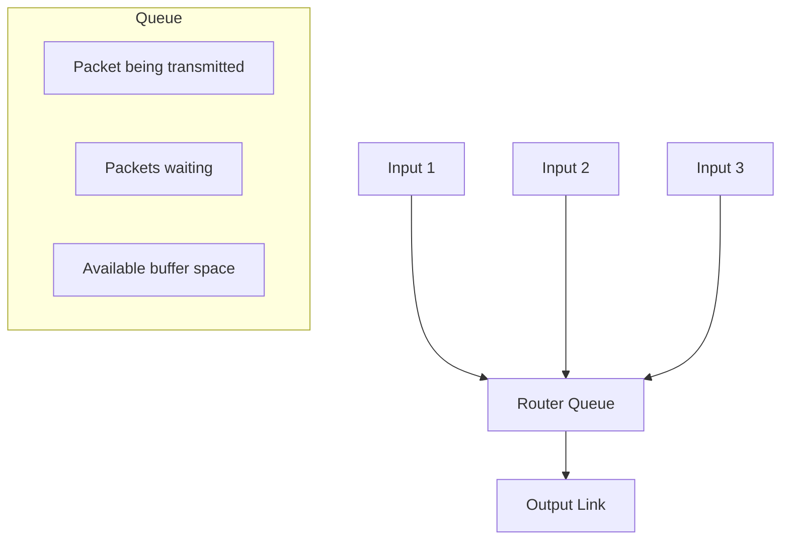
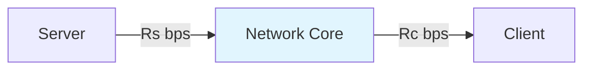
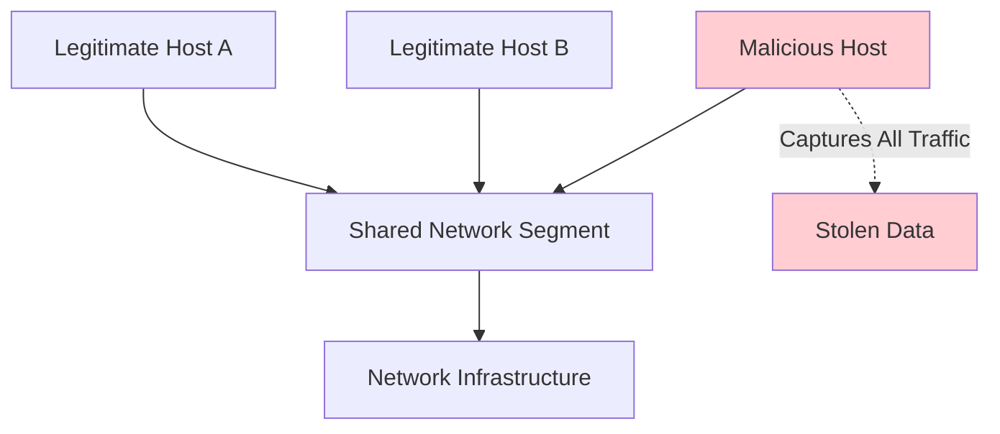
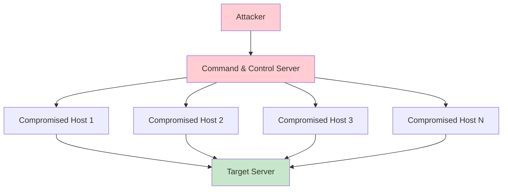
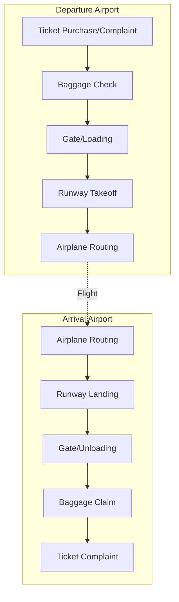
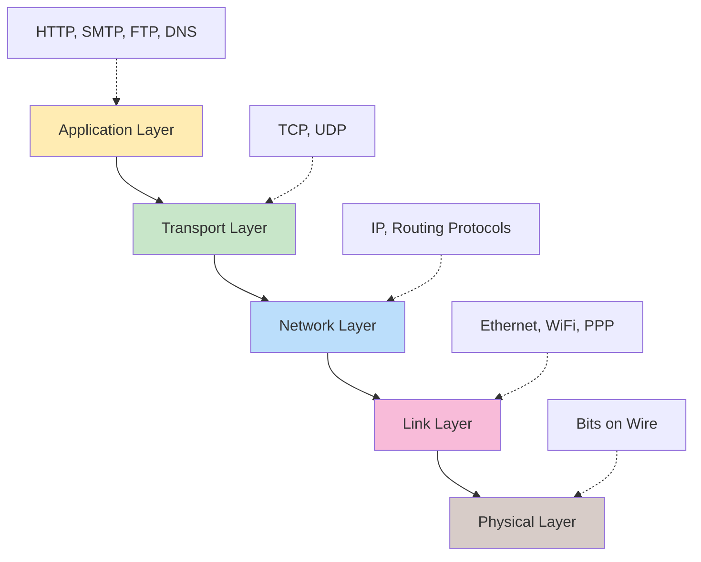

# CS-455 Computer Networking: Introduction to Networks
*Complete Lecture Notes - Chapter 1*

---

## Table of Contents

1. [Course Overview and Learning Objectives](#1-course-overview-and-learning-objectives)
2. [What is the Internet?](#2-what-is-the-internet)
3. [Network Protocols](#3-network-protocols)
4. [Network Edge: End Systems and Access Networks](#4-network-edge-end-systems-and-access-networks)
5. [Physical Media](#5-physical-media)
6. [Network Core: Packet and Circuit Switching](#6-network-core-packet-and-circuit-switching)
7. [Internet Structure: Network of Networks](#7-internet-structure-network-of-networks)
8. [Performance Analysis: Delay, Loss, and Throughput](#8-performance-analysis-delay-loss-and-throughput)
9. [Network Security Fundamentals](#9-network-security-fundamentals)
10. [Protocol Layers and Service Models](#10-protocol-layers-and-service-models)
11. [Internet History: From ARPANET to Today](#11-internet-history-from-arpanet-to-today)
12. [Key Terminology and Formulas Reference](#12-key-terminology-and-formulas-reference)

---

## 1. Course Overview and Learning Objectives

### 1.1 Chapter Goals

Upon completing this introduction, you should be able to:

- **Understand** the fundamental concepts of networking and internet architecture
- **Distinguish** between different network components (hosts, routers, links, protocols)
- **Explain** the difference between packet switching and circuit switching
- **Calculate** basic performance metrics (delay, throughput, loss)
- **Describe** the layered approach to network protocols
- **Analyze** security challenges in network design
- **Trace** the historical development of the Internet from ARPANET

### 1.2 Topics Overview

This chapter provides a "big picture" introduction to networking terminology and concepts. More depth and detail will be covered in subsequent chapters. We'll explore:

- **Network fundamentals**: Internet structure, protocols, and basic terminology
- **Physical infrastructure**: Network edge, access networks, and transmission media
- **Core technologies**: Packet/circuit switching and network architecture
- **Performance metrics**: Understanding delay, loss, and throughput
- **Layered design**: Protocol stacks and service models
- **Security awareness**: Common threats and basic defense mechanisms
- **Historical context**: Evolution from ARPANET to modern Internet

---

## 2. What is the Internet?

### 2.1 Nuts and Bolts Description

The Internet is a **global network of interconnected computing devices** that communicate using standardized protocols. Let's break down its key components:

#### Core Components

**Computing Devices (Hosts/End Systems)**
- Billions of connected devices including computers, smartphones, servers, IoT devices
- Run network applications and generate/consume data
- Sit at the "edge" of the network

**Communication Infrastructure**
- **Links**: Physical connections (fiber optic, copper wire, wireless) with specific transmission rates (bandwidth measured in bits per second)
- **Packet switches**: Routers and switches that forward data packets
- **Networks**: Collections of devices, routers, and links managed by organizations

**Internet Structure**
- Network of networks with interconnected Internet Service Providers (ISPs)
- Hierarchical structure from local access to global backbone networks
- Protocols control all message transmission and reception

#### Key Protocols and Standards

**Common Protocols**
- **HTTP/HTTPS**: Web communication
- **SMTP/IMAP**: Email
- **FTP**: File transfer
- **DNS**: Domain name resolution
- **TCP/IP**: Core Internet protocols
- **WiFi, 4G/5G, Ethernet**: Link-layer protocols

**Standards Organizations**
- **IETF (Internet Engineering Task Force)**: Develops Internet standards
- **RFC (Request for Comments)**: Documents that define Internet standards and best practices

### 2.2 Service Description

The Internet serves as **infrastructure providing services to applications**:

#### Application Services
- Web browsing and content delivery
- Video streaming and multimedia
- Email and instant messaging
- Online gaming and social media
- E-commerce and financial services
- Internet of Things (IoT) applications

#### Programming Interface
The Internet provides a **programming interface to distributed applications** through:
- "Hooks" that allow applications to connect to Internet transport services
- Service options analogous to postal service (reliable vs. fast delivery)
- Socket interfaces and APIs for application development

### 2.3 Internet-Connected Devices: Beyond Traditional Computers

Modern Internet connectivity extends far beyond traditional computers:

**Smart Home Devices**
- Web-enabled appliances (refrigerators, thermostats, security cameras)
- Voice assistants (Amazon Echo, Google Home)
- Smart lighting and automation systems

**Wearable Technology**
- Fitness trackers and smartwatches
- Health monitoring devices and medical implants
- Augmented reality devices

**Transportation**
- Connected cars with navigation and entertainment systems
- Electric scooters and bike-sharing systems
- Autonomous vehicle communication systems

**Industrial IoT**
- Manufacturing equipment and sensors
- Environmental monitoring systems
- Smart city infrastructure

---

## 3. Network Protocols

### 3.1 Protocol Definition and Importance

**Network protocols define the format, order of messages sent and received among network entities, and actions taken on message transmission and receipt.**

Think of protocols as the "rules of communication" that ensure different devices can understand each other, regardless of their manufacturer or operating system.

### 3.2 Human vs. Network Protocols

#### Human Protocol Examples
- **Meeting etiquette**: "Hello," introductions, turn-taking in conversation
- **Phone conversations**: "Hello?" → "Hi, it's [name]" → conversation → "Goodbye"
- **Classroom interactions**: Raising hands, waiting to be called upon

#### Network Protocol Characteristics
- **Participants**: Computers and network devices (not humans)
- **Precision**: Exact message formats and timing requirements
- **Error handling**: Built-in mechanisms for dealing with transmission problems
- **Universality**: All Internet communication governed by protocols

### 3.3 Protocol Example: Web Request Process

Let's trace a typical web request to understand protocol interactions:



**Step-by-step Protocol Interaction:**

1. **TCP Connection Establishment**: Client initiates reliable connection
2. **Connection Acknowledgment**: Server confirms connection establishment
3. **HTTP Request**: Client sends specific request for web page
4. **Content Delivery**: Server responds with requested file
5. **Connection Termination**: Clean closure of communication session

This example shows how multiple protocols (TCP for reliable transport, HTTP for web communication) work together to accomplish a single task.

---

## 4. Network Edge: End Systems and Access Networks

### 4.1 End Systems (Hosts)

**End systems** are devices that run network applications and sit at the edge of the network.

#### Categories of End Systems

**Client Systems**
- Personal computers and laptops
- Smartphones and tablets
- Smart TVs and gaming consoles
- IoT devices and sensors

**Server Systems**
- Web servers hosting websites and applications
- Database servers storing and managing data
- Cloud computing infrastructure
- Content delivery network (CDN) servers
- Often located in specialized data centers for reliability and performance

### 4.2 Access Networks

**Access networks** physically connect end systems to the first router (edge router) on their path to other end systems.

#### 4.2.1 Home Access Technologies

**Digital Subscriber Line (DSL)**
- **Technology**: Uses existing telephone infrastructure
- **Operation**: Voice and data transmitted at different frequencies over same line
- **Speeds**: 
  - Downstream: 24-52 Mbps (dedicated)
  - Upstream: 3.5-16 Mbps (dedicated)
- **Advantages**: Dedicated bandwidth, widely available
- **Limitations**: Speed decreases with distance from central office

**Cable Internet Access**
- **Technology**: Uses cable TV infrastructure (Hybrid Fiber Coax - HFC)
- **Operation**: Data and TV signals at different frequencies, shared bandwidth
- **Speeds**:
  - Downstream: 40 Mbps to 1.2 Gbps
  - Upstream: 30-100 Mbps
- **Key Component**: CMTS (Cable Modem Termination System)
- **Multiplexing**: FDM (Frequency Division Multiplexing) separates channels
- **Limitation**: Bandwidth shared among neighborhood users

**Fiber to the Home (FTTH)**
- **Technology**: Optical fiber directly to residential premises
- **Architecture**: 
  - AON (Active Optical Networks)
  - PON (Passive Optical Networks)
- **Speeds**: Gigabit speeds and beyond
- **Advantages**: Highest bandwidth, future-proof
- **Challenges**: Installation cost and availability

**Satellite Internet**
- **Technology**: Communication via geostationary or low-earth orbit satellites
- **Speeds**: Up to 100+ Mbps (modern systems)
- **Latency**: 280ms (geostationary), 20-40ms (LEO)
- **Use cases**: Rural areas, remote locations

#### 4.2.2 Wireless Access Networks

**Wireless Local Area Networks (WLANs)**
- **Technology**: IEEE 802.11 (WiFi) standards
- **Range**: ~100 feet from access point
- **Speeds**: 
  - 802.11b: 11 Mbps
  - 802.11g: 54 Mbps  
  - 802.11n: 450 Mbps
  - 802.11ac: 1+ Gbps
  - 802.11ax (WiFi 6): Multi-gigabit

**Wide-Area Cellular Networks**
- **Coverage**: 10s of kilometers from base station
- **Technologies**:
  - 4G LTE: 10-100 Mbps
  - 5G: 100 Mbps to 10+ Gbps
- **Mobility**: Seamless handoff between cell towers

#### 4.2.3 Enterprise and Institutional Networks

**Enterprise Network Characteristics**
- **Wired backbone**: Ethernet at 100 Mbps, 1 Gbps, 10 Gbps, 100 Gbps
- **Wireless access**: WiFi throughout facilities
- **Infrastructure**: Ethernet switches connecting departments
- **Internet connection**: High-speed links to ISPs

**Data Center Networks**
- **Scale**: Hundreds to thousands of servers
- **Bandwidth**: 10s to 100s Gbps links between servers
- **Architecture**: Specialized topologies for high performance
- **Redundancy**: Multiple paths for fault tolerance

### 4.3 Host Packet Transmission Process

When a host sends data, it follows these steps:

**Packetization Process**
1. **Application data**: Takes message from application
2. **Segmentation**: Breaks message into packets of length L bits
3. **Transmission**: Sends packets into access network at rate R bps

**Key Formula: Packet Transmission Delay**
```
Transmission Delay = L (bits) / R (bits/sec)
```

**Calculation Example**
- **Given**: 10 Mbps link, 3000-byte packet
- **Convert**: 3000 bytes × 8 = 24,000 bits; 10 Mbps = 10 × 10⁶ bps
- **Calculate**: 24,000 / (10 × 10⁶) = 0.0024 seconds = 2.4 milliseconds

---

## 5. Physical Media

Understanding the physical layer helps explain network performance characteristics and limitations.

### 5.1 Guided Media (Wired)

#### 5.1.1 Twisted-Pair Copper Wire

**Structure and Operation**
- Two insulated copper wires twisted together
- Twisting reduces electromagnetic interference
- Most common guided medium

**Performance Categories**
- **Category 5 (Cat 5)**: 100 Mbps Ethernet, 1 Gbps
- **Category 6 (Cat 6)**: 10 Gbps Ethernet
- **Category 6A/7**: Higher frequencies, longer distances

**Characteristics**
- **Cost**: Inexpensive and easy to install
- **Limitations**: Susceptible to electromagnetic interference
- **Applications**: Home networks, office LANs

#### 5.1.2 Coaxial Cable

**Structure**
- Two concentric copper conductors
- Better shielding than twisted pair

**Capabilities**
- **Bidirectional transmission**
- **Broadband support**: Multiple frequency channels
- **Bandwidth**: 100s Mbps per channel

**Applications**
- Cable TV and internet infrastructure
- Legacy Ethernet (10Base2, 10Base5)

#### 5.1.3 Fiber Optic Cable

**Technology**
- Glass fiber carrying light pulses
- Each pulse represents a bit (light = 1, no light = 0)

**Advantages**
- **High speed**: 10s to 100s Gbps point-to-point
- **Low error rate**: Immune to electromagnetic interference
- **Long distance**: Repeaters spaced far apart
- **Security**: Difficult to tap without detection

**Applications**
- Internet backbone links
- Long-distance telephone networks
- High-speed LANs

### 5.2 Unguided Media (Wireless)

#### 5.2.1 Radio Transmission Characteristics

**Signal Properties**
- Carried in electromagnetic spectrum bands
- No physical wire required
- Broadcast nature (multiple receivers possible)
- Half-duplex (sender OR receiver, not both simultaneously)

**Environmental Challenges**
- **Reflection**: Signals bounce off objects
- **Obstruction**: Physical barriers block signals
- **Interference**: Other devices and noise
- **Multipath fading**: Multiple signal paths arrive at different times

#### 5.2.2 Radio Link Types by Range and Application

**Personal Area Networks**
- **Bluetooth**: 10 meters, 1-3 Mbps
- **Near Field Communication (NFC)**: < 10 cm, 424 kbps

**Local Area Networks (WiFi)**
- **Range**: 10-100 meters
- **Speeds**: 10-1000s Mbps
- **Standards**: 802.11 family

**Wide Area Networks**
- **Cellular (4G/5G)**: 10s Mbps over ~10 km
- **Satellite**: Up to 100s Mbps, global coverage
- **Terrestrial microwave**: Point-to-point, 45 Mbps channels

**Satellite Communication Details**
- **Geostationary orbit**: 35,786 km altitude, 270ms end-to-end delay
- **Low Earth Orbit (LEO)**: 200-1,200 km altitude, 20-40ms delay
- **Applications**: Rural internet, backup communications, global coverage

---

## 6. Network Core: Packet and Circuit Switching

The network core consists of interconnected routers forming a mesh topology that forwards data between end systems.

### 6.1 Core Network Functions

#### 6.1.1 Forwarding (Switching)

**Definition**: Local action of moving arriving packets from input link to appropriate output link

**Process**:
1. Examine packet header
2. Consult forwarding table
3. Determine output link
4. Forward packet

**Forwarding Table**: Maps destination addresses (or prefixes) to output links

#### 6.1.2 Routing

**Definition**: Global action of determining source-to-destination paths

**Process**:
1. Run routing algorithms
2. Build and maintain forwarding tables
3. Adapt to network changes
4. Share routing information with other routers

**Routing vs. Forwarding**: Routing is like planning a trip route; forwarding is like following road signs at each intersection.

### 6.2 Packet Switching

#### 6.2.1 Store-and-Forward Transmission

**Core Principle**: Router must receive entire packet before transmitting it on outbound link



**Timing Analysis**:
- **Time to transmit packet**: L/R seconds
- **Store-and-forward delay**: Must wait for complete packet
- **Total delay for one hop**: 2L/R seconds

**Mathematical Example**:
- **Packet size (L)**: 10,000 bits
- **Link rate (R)**: 100 Mbps = 100 × 10⁶ bps
- **One-hop transmission delay**: 10,000 / (100 × 10⁶) = 0.1 milliseconds
- **Store-and-forward delay**: 0.1 ms (wait for complete packet)

#### 6.2.2 Queuing and Packet Loss

**Queuing Necessity**
- Occurs when arrival rate temporarily exceeds output capacity
- Packets wait in router buffers
- Multiple inputs may send to same output simultaneously



**Packet Loss Mechanism**
- **Finite buffers**: Queues have limited capacity
- **Buffer overflow**: Arriving packets dropped when queue full
- **Performance impact**: Lost packets require retransmission
- **Applications**: Must handle lost packets appropriately

### 6.3 Circuit Switching

#### 6.3.1 Circuit Switching Characteristics

**Resource Reservation**
- End-to-end resources reserved for entire call duration
- Dedicated bandwidth guaranteed
- Circuit established before data transmission
- Resources released when call ends

**Performance Guarantees**
- **Consistent bandwidth**: No sharing with other users
- **Predictable delay**: No queuing delays
- **Reliable transmission**: Circuit quality maintained

**Efficiency Trade-offs**
- **Unused resources**: Circuit idle when not transmitting
- **Setup overhead**: Time to establish circuit
- **Inflexibility**: Cannot adapt to traffic bursts

#### 6.3.2 Multiplexing in Circuit Switching

**Frequency Division Multiplexing (FDM)**
- **Technique**: Divide frequency spectrum into bands
- **Allocation**: Each call gets dedicated frequency band
- **Capacity**: Limited by available spectrum
- **Example**: Traditional telephone systems

**Time Division Multiplexing (TDM)**  
- **Technique**: Divide time into recurring slots
- **Allocation**: Each call gets dedicated time slots
- **Rotation**: Slots cycle among active calls
- **Efficiency**: Better spectrum utilization than FDM

#### 6.3.3 Circuit Switching Example Network

**Network Configuration**:
- A-B link: 20 circuits
- B-C link: 19 circuits  
- C-D link: 15 circuits
- D-A link: 16 circuits

**Capacity Analysis**:
- **Bottleneck**: C-D link with 15 circuits
- **Maximum simultaneous calls**: 15
- **Resource allocation**: End-to-end reservation required

### 6.4 Packet vs. Circuit Switching Comparison

#### 6.4.1 Quantitative Example

**Network Scenario**:
- **Link capacity**: 1 Gbps
- **User requirements**: 100 Mbps when active
- **Activity pattern**: 10% active time

**Circuit Switching Capacity**:
- **Maximum users**: 1000 Mbps ÷ 100 Mbps = 10 users
- **Resource utilization**: Often low due to idle periods

**Packet Switching Capacity**:
- **Statistical multiplexing**: More than 10 users supported
- **Probability analysis**: Low probability all users active simultaneously
- **Better utilization**: Resources shared dynamically

#### 6.4.2 Advantages and Disadvantages

**Packet Switching Advantages**:
- **Efficient bandwidth use**: No idle circuit reservation
- **Flexibility**: Handles bursty traffic well
- **Minimal setup**: No call establishment required
- **Cost-effective**: Better resource utilization

**Packet Switching Disadvantages**:
- **Variable delay**: Queuing delays under congestion
- **Possible loss**: Buffer overflow during congestion
- **Complex protocols**: Requires reliable delivery mechanisms
- **Unpredictable performance**: No bandwidth guarantees

**Circuit Switching Advantages**:
- **Guaranteed performance**: Predictable bandwidth and delay
- **Simple data transfer**: Once circuit established
- **No loss**: Dedicated resources prevent packet drops
- **Quality assurance**: Suitable for real-time applications

**Circuit Switching Disadvantages**:
- **Resource waste**: Idle circuits not available to others
- **Setup complexity**: Call establishment overhead
- **Inflexibility**: Cannot handle traffic variations
- **Limited sharing**: No statistical multiplexing benefits

---

## 7. Internet Structure: Network of Networks

### 7.1 The Challenge of Global Connectivity

**Fundamental Problem**: How do we connect millions of access ISPs worldwide?

**Naive Solution Issues**:
- **Direct connections**: Every ISP to every other ISP
- **Complexity**: O(N²) connections required
- **Cost**: Prohibitively expensive
- **Management**: Unscalable maintenance burden

### 7.2 Internet Structure Evolution

#### 7.2.1 Single Global ISP Model

**Concept**: Connect all access ISPs to one global transit provider

**Business Model**:
- **Customer-provider relationship**: Access ISPs pay global ISP
- **Economic incentive**: Revenue from connectivity services
- **Centralized routing**: Simplified path determination

**Limitations**:
- **Single point of failure**: Network reliability concerns
- **Monopoly concerns**: No competitive pressure
- **Scalability issues**: One provider serving all customers

#### 7.2.2 Competing Global ISPs

**Market Evolution**: Multiple global ISPs emerge to compete

**Interconnection Necessity**:
- **Peering**: Direct connections between competing ISPs
- **Internet Exchange Points (IXPs)**: Shared interconnection facilities
- **Settlement-free peering**: Mutual benefit arrangements

**Benefits**:
- **Competition**: Improved services and pricing
- **Redundancy**: Multiple path options
- **Innovation**: Technology advancement pressure

#### 7.2.3 Regional ISP Emergence

**Market Gap**: Cost-effective connection for smaller access ISPs

**Regional ISP Function**:
- **Aggregation**: Collect traffic from multiple access ISPs
- **Transit**: Purchase connectivity from global ISPs
- **Local presence**: Better customer service and lower latency

**Economic Model**:
- Access ISPs pay regional ISPs
- Regional ISPs pay global (Tier-1) ISPs
- Regional ISPs may peer with each other

#### 7.2.4 Content Provider Networks

**Content Provider Evolution**: Google, Facebook, Microsoft, Netflix

**Motivation**:
- **Cost reduction**: Bypass ISP charges
- **Performance improvement**: Direct control over content delivery
- **Global reach**: Private international networks

**Content Delivery Strategy**:
- **Edge servers**: Content close to users
- **CDN (Content Delivery Networks)**: Distributed caching
- **Direct peering**: Connect directly to access ISPs

### 7.3 Modern Internet Hierarchy

#### 7.3.1 Tier-1 ISPs

**Characteristics**:
- **Global coverage**: International backbone networks
- **Settlement-free peering**: Don't pay for transit
- **Examples**: AT&T, Verizon, Sprint, Level 3, NTT
- **Infrastructure**: High-capacity fiber optic networks

#### 7.3.2 Tier-2 ISPs (Regional ISPs)

**Characteristics**:
- **Regional coverage**: National or multi-regional
- **Customers**: Pay Tier-1 ISPs for global connectivity
- **Peers**: Connect with other Tier-2 ISPs
- **Examples**: Regional telecom companies

#### 7.3.3 Tier-3 ISPs (Access ISPs)

**Characteristics**:
- **Local coverage**: Cities, regions, or specific markets
- **Customers**: End users and small businesses
- **Transit providers**: Purchase connectivity from Tier-2/Tier-1
- **Examples**: Local cable companies, DSL providers

#### 7.3.4 Internet Exchange Points (IXPs)

**Function**: Shared facilities where ISPs interconnect

**Benefits**:
- **Cost reduction**: Avoid paying upstream providers for local traffic
- **Performance**: Shorter paths between networks
- **Resilience**: Multiple connection options

**Examples**: 
- DE-CIX (Germany)
- AMS-IX (Amsterdam)  
- LINX (London)

### 7.4 Internet Structure Summary

The modern Internet is **a network of networks** with:

- **Hierarchical structure**: Tier-1, Tier-2, Tier-3 ISPs
- **Economic relationships**: Customer-provider and peering
- **Interconnection points**: IXPs facilitate efficient peering
- **Content networks**: Major content providers with private infrastructure
- **Regional variations**: Different structures in different regions

This structure enables global connectivity while providing economic incentives for network investment and maintenance.

---

## 8. Performance Analysis: Delay, Loss, and Throughput

Understanding network performance is crucial for designing, analyzing, and troubleshooting computer networks.

### 8.1 Packet Delay Components

Every packet experiences delay as it travels through the network. **Total nodal delay** consists of four components:

```
Total Delay = Processing Delay + Queuing Delay + Transmission Delay + Propagation Delay
dnodal = dproc + dqueue + dtrans + dprop
```

#### 8.1.1 Processing Delay (dproc)

**Activities Performed**:
- Examine packet header fields
- Determine output link using forwarding table
- Check for bit errors (checksums)
- Update header fields (TTL decrement)

**Characteristics**:
- **Magnitude**: Microseconds or less in modern routers
- **Variability**: Relatively constant and predictable
- **Factors**: Router processing power, forwarding table size

#### 8.1.2 Queuing Delay (dqueue)

**Cause**: Waiting in output buffer for transmission

**Characteristics**:
- **Variability**: Most variable component of delay
- **Range**: Zero (no queue) to seconds (heavy congestion)
- **Dependency**: Network congestion level

**Traffic Intensity Analysis**:
```
Traffic Intensity = La/R
where:
- L = packet length (bits)
- a = average packet arrival rate (packets/sec)
- R = link bandwidth (bits/sec)
```

**Queuing Behavior**:
- **La/R ≈ 0**: Minimal queuing delay
- **La/R → 1**: Rapidly increasing delay
- **La/R > 1**: Unstable system, infinite average delay

#### 8.1.3 Transmission Delay (dtrans)

**Definition**: Time to push all packet bits onto the link

**Formula**:
```
dtrans = L/R
where:
- L = packet length (bits)
- R = link transmission rate (bits/sec)
```

**Characteristics**:
- **Dependency**: Function of packet size and link speed only
- **Independence**: Not related to distance between nodes
- **Alternative names**: Store-and-forward delay, serialization delay

**Example Calculation**:
- **Packet size**: 1000 bytes = 8000 bits
- **Link rate**: 10 Mbps = 10 × 10⁶ bps
- **Transmission delay**: 8000 / (10 × 10⁶) = 0.8 milliseconds

#### 8.1.4 Propagation Delay (dprop)

**Definition**: Time for signal to travel from source to destination

**Formula**:
```
dprop = d/s
where:
- d = length of physical link (meters)
- s = propagation speed (~2 × 10⁸ m/s in copper/fiber)
```

**Propagation Speeds**:
- **Vacuum (speed of light)**: 3 × 10⁸ m/s
- **Fiber optic cable**: ~2 × 10⁸ m/s
- **Copper wire**: ~2.3 × 10⁸ m/s

**Example Calculation**:
- **Distance**: 3000 km = 3 × 10⁶ meters
- **Speed**: 2 × 10⁸ m/s
- **Propagation delay**: (3 × 10⁶) / (2 × 10⁸) = 15 milliseconds

### 8.2 Queuing Delay Analysis

#### 8.2.1 Traffic Intensity Impact

**Mathematical Model**:
- **Arrival rate**: a packets/second
- **Service rate**: R/L packets/second
- **Utilization**: ρ = La/R

**Queue Behavior Regions**:

1. **Light Traffic (La/R ≈ 0)**:
   - Average queuing delay ≈ 0
   - Packets rarely wait

2. **Moderate Traffic (La/R ≈ 0.5)**:
   - Average queuing delay = (La/R) / (2(1 - La/R))
   - Noticeable but manageable delays

3. **Heavy Traffic (La/R → 1)**:
   - Average queuing delay → ∞
   - System becomes unstable

4. **Overload (La/R > 1)**:
   - Queue grows without bound
   - Packet loss inevitable

#### 8.2.2 Queuing Models

**M/M/1 Queue (Poisson Arrivals, Exponential Service)**:
```
Average Queuing Delay = ρ / (1 - ρ) × (L/R)
where ρ = La/R
```

This model assumes:
- Poisson arrival process
- Exponential service times
- Single server (output link)
- Infinite buffer capacity

### 8.3 Packet Loss

#### 8.3.1 Loss Mechanisms

**Buffer Overflow**:
- **Finite buffers**: Real routers have limited memory
- **Congestion**: Arrival rate exceeds departure rate
- **Drop policies**: Tail drop, random early detection

**Loss Consequences**:
- **Retransmission**: End systems may retransmit lost packets
- **Application impact**: Depends on application requirements
- **Performance degradation**: Reduced effective throughput

#### 8.3.2 Loss Probability

**Buffer Occupancy Model**:
- **Traffic intensity**: Higher La/R increases loss probability
- **Buffer size**: Larger buffers reduce loss probability
- **Burst characteristics**: Traffic burstiness affects loss

### 8.4 End-to-End Delay Analysis

#### 8.4.1 Caravan Analogy

**Highway Scenario**:
- **Cars**: Bits in a packet
- **Caravan**: Complete packet
- **Toll booth**: Router with store-and-forward processing
- **Highway**: Communication link

**Timing Analysis**:
1. **Caravan formation**: Time to create packet
2. **Toll booth service**: Transmission delay (L/R)
3. **Highway travel**: Propagation delay (d/s)
4. **Multiple toll booths**: Multiple router hops

**Example Calculation**:
- **10 cars**: 10-bit packet
- **Service time**: 12 seconds per car
- **Highway distance**: 100 km at 100 km/hr

**Results**:
- **Service time**: 10 × 12 = 120 seconds
- **Travel time**: 100 km ÷ 100 km/hr = 3600 seconds
- **Total time**: 120 + 3600 = 3720 seconds

#### 8.4.2 Store-and-Forward vs. Cut-Through

**Store-and-Forward**:
- **Requirement**: Complete packet received before forwarding
- **Advantage**: Error checking possible
- **Delay**: Full transmission delay at each hop

**Cut-Through (Theoretical)**:
- **Concept**: Forward bits as soon as received
- **Advantage**: Reduced delay for long packets
- **Reality**: Not used due to error checking requirements

### 8.5 Throughput Analysis

#### 8.5.1 Throughput Definition

**Instantaneous Throughput**: Rate of data transfer at specific moment
**Average Throughput**: Rate of data transfer over extended period

**Units**: Typically measured in bits/second (bps)

#### 8.5.2 Bottleneck Link Analysis



**End-to-End Throughput**: Limited by slowest link (bottleneck)

**Formula**:
```
Throughput = min{Rs, R1, R2, ..., RN, Rc}
```

**Common Scenarios**:
- **Server-limited**: Rs < Rc (server upload speed limits)
- **Client-limited**: Rc < Rs (client download speed limits)
- **Network-limited**: Internal link capacity limits

#### 8.5.3 Shared Bottleneck Analysis

**Multiple Connection Scenario**:
- **N connections**: Sharing bottleneck link of capacity R
- **Per-connection throughput**: R/N (assuming fair sharing)
- **Individual link rates**: Rs, Rc for each connection

**Effective Throughput**:
```
Per-connection throughput = min{Rs, Rc, R/N}
```

**Example**:
- **Shared link**: 100 Mbps
- **10 connections**: Each gets 10 Mbps maximum
- **Individual rates**: 50 Mbps server, 20 Mbps client
- **Result**: 10 Mbps per connection (shared link is bottleneck)

### 8.6 Traceroute: Measuring Real Network Performance

#### 8.6.1 Traceroute Operation

**Principle**: Send packets with increasing Time-To-Live (TTL) values

**Process**:
1. **TTL = 1**: Packet expires at first router, returns ICMP error
2. **TTL = 2**: Packet expires at second router, returns ICMP error
3. **Continue**: Until reaching destination

**Measurements**:
- **Round-trip time**: Time from send to receive response
- **Router identification**: IP address of each hop
- **Path discovery**: Complete route to destination

#### 8.6.2 Traceroute Output Analysis

**Example Output**:
```
1 cs-gw (128.119.240.254) 1 ms 1 ms 2 ms
2 border1-rt (128.119.3.145) 1 ms 1 ms 2 ms
3 gw1.domain.net (192.168.1.1) 104 ms 109 ms 106 ms
```

**Interpretation**:
- **Hop number**: Sequential router in path
- **Router name/IP**: Identity of router
- **Three measurements**: Multiple probes for accuracy
- **Time values**: Round-trip delay to each router

**Key Observations**:
- **Delay variations**: Show network variability
- **Geographic changes**: Sudden delay increases indicate long-distance links
- **Missing responses**: "*" indicates packet loss or no response

---

## 9. Network Security Fundamentals

### 9.1 Security in Network Design

#### 9.1.1 Original Internet Philosophy

**Historical Context**: The Internet was not originally designed with security as a primary concern.

**Original Assumptions**:
- **Trusted users**: "Mutually trusting users attached to transparent network"
- **Academic environment**: Cooperation rather than competition
- **Small scale**: Limited number of known participants
- **Research focus**: Functionality over security

**Modern Reality**:
- **Billions of users**: Many with malicious intent
- **Critical infrastructure**: Economic and social dependence
- **Valuable data**: Financial and personal information
- **Global reach**: Crossing legal and cultural boundaries

#### 9.1.2 Security as an Afterthought

**Consequence**: Security mechanisms retrofitted to existing protocols

**Challenges**:
- **Backward compatibility**: Cannot break existing systems
- **Performance impact**: Security often adds overhead
- **Deployment complexity**: Coordinating upgrades across global infrastructure
- **Economic factors**: Security costs vs. security benefits

### 9.2 Common Network Security Threats

#### 9.2.1 Packet Interception (Sniffing)

**Attack Method**: Monitoring network traffic to capture data



**Vulnerable Technologies**:
- **Shared Ethernet**: Hub-based networks (largely obsolete)
- **Wireless networks**: Radio transmissions inherently broadcast
- **Compromised infrastructure**: Malicious access points or switches

**Attack Techniques**:
- **Promiscuous mode**: Network interface captures all packets
- **ARP spoofing**: Redirecting traffic through attacker's machine
- **DNS spoofing**: Redirecting traffic to malicious servers

**Captured Information**:
- **Passwords**: Especially clear-text protocols
- **Personal data**: Email, documents, browsing history
- **Business secrets**: Confidential communications

**Tools**:
- **Wireshark**: Legitimate network analysis tool, also used maliciously
- **tcpdump**: Command-line packet capture
- **Specialized hardware**: High-speed packet capture devices

#### 9.2.2 IP Spoofing (False Identity)

**Attack Method**: Creating packets with false source IP addresses

**Process**:
1. **Packet creation**: Attacker crafts packet with fake source
2. **Injection**: Packet sent into network
3. **Deception**: Receiver believes packet from trusted source
4. **Response misdirection**: Replies may go to spoofed address

**Attack Scenarios**:
- **Access control bypass**: Impersonating trusted IP addresses
- **DoS amplification**: Causing responses to flood third parties
- **Session hijacking**: Taking over existing connections

**Why It Works**:
- **No authentication**: Basic IP provides no source verification
- **Routing trust**: Routers forward based on destination, not source validation
- **Stateless protocol**: Each packet processed independently

#### 9.2.3 Denial of Service (DoS) Attacks

**Goal**: Make network resources unavailable to legitimate users

**Attack Categories**:

**Vulnerability Attacks**:
- **Target**: Software bugs and design flaws
- **Method**: Send malformed packets to crash services
- **Example**: Buffer overflow exploits

**Bandwidth Flooding**:
- **Target**: Network capacity
- **Method**: Overwhelm with excessive traffic
- **Result**: Legitimate traffic cannot get through

**Connection Flooding**:
- **Target**: Server connection tables
- **Method**: Open many connections without completing them
- **Result**: Server cannot accept new legitimate connections

#### 9.2.4 Distributed Denial of Service (DDoS)

**Concept**: Coordinated attack from multiple sources



**Attack Process**:
1. **Recruitment**: Compromise many hosts (create botnet)
2. **Coordination**: Central command and control system
3. **Launch**: Simultaneous attack from all compromised hosts
4. **Amplification**: Distributed sources multiply attack power

**Why Effective**:
- **Scale**: Can generate massive traffic volumes
- **Distribution**: Difficult to block all attack sources
- **Legitimacy**: Traffic may appear normal from individual sources
- **Persistence**: Can continue even if some sources blocked

#### 9.2.5 Malware and Botnets

**Malware Types**:

**Viruses**:
- **Propagation**: Requires user interaction (email attachments)
- **Activation**: User must execute infected file
- **Replication**: Infects other files on same system

**Worms**:
- **Propagation**: Self-spreading without user interaction
- **Network-based**: Exploits network services and protocols
- **Automatic**: Spreads by scanning and infecting vulnerable systems

**Spyware**:
- **Function**: Records user activities
- **Data collection**: Keystrokes, web browsing, personal information
- **Transmission**: Uploads data to collection servers

**Botnet Creation**:
1. **Initial infection**: Malware installed on target systems
2. **Communication**: Infected systems contact command servers
3. **Control establishment**: Attacker can remotely control infected systems
4. **Utilization**: Use infected systems for various attacks

**Botnet Applications**:
- **DDoS attacks**: Coordinated traffic flooding
- **Spam distribution**: Email spam from many sources
- **Click fraud**: Artificial website traffic for advertising fraud
- **Cryptocurrency mining**: Using victim's computing resources

### 9.3 Defense Mechanisms

#### 9.3.1 Authentication

**Purpose**: Verify identity of communicating parties

**Methods**:

**Something You Know**:
- **Passwords**: Secret phrases or codes
- **PINs**: Personal identification numbers
- **Security questions**: Personal information verification

**Something You Have**:
- **Smart cards**: Physical devices with embedded secrets
- **Hardware tokens**: Generate one-time passwords
- **SIM cards**: Cellular authentication

**Something You Are**:
- **Biometrics**: Fingerprints, facial recognition, iris scans
- **Behavioral patterns**: Typing rhythms, mouse movement

**Challenge-Response Protocols**:
1. **Challenge**: Server sends random data
2. **Response**: Client proves identity using secret
3. **Verification**: Server validates response

#### 9.3.2 Confidentiality through Encryption

**Symmetric Key Cryptography**:
- **Concept**: Same key for encryption and decryption
- **Advantage**: Fast operation
- **Challenge**: Key distribution and management
- **Examples**: AES, DES

**Public Key Cryptography**:
- **Concept**: Different keys for encryption (public) and decryption (private)
- **Advantage**: No need to share secret keys
- **Challenge**: Slower than symmetric encryption
- **Examples**: RSA, ECC

**Hybrid Systems**:
- **Approach**: Use public key to exchange symmetric keys
- **Benefit**: Combines speed and security
- **Implementation**: TLS/SSL protocols

#### 9.3.3 Integrity Protection

**Digital Signatures**:
- **Function**: Prove message authenticity and integrity
- **Process**: Use private key to "sign" message
- **Verification**: Public key confirms signature validity

**Message Authentication Codes (MAC)**:
- **Function**: Detect message tampering
- **Process**: Generate checksum using shared secret
- **Verification**: Receiver recalculates and compares MAC

**Hash Functions**:
- **Function**: Generate fixed-size "fingerprint" of data
- **Properties**: One-way, collision-resistant
- **Examples**: SHA-256, MD5 (deprecated)

#### 9.3.4 Access Control

**Network Access Control**:
- **VPNs**: Virtual Private Networks with authentication
- **802.1X**: Port-based network access control
- **Network segmentation**: Isolate sensitive resources

**Role-Based Access Control**:
- **Principle**: Access based on user roles and responsibilities
- **Implementation**: Group permissions and inheritance
- **Administration**: Centralized policy management

#### 9.3.5 Firewalls

**Firewall Principles**:
- **Default deny**: Block all traffic except explicitly allowed
- **Least privilege**: Minimum necessary access
- **Defense in depth**: Multiple layers of protection

**Filtering Criteria**:
- **Source/destination addresses**: IP address-based rules
- **Port numbers**: Application-specific filtering
- **Protocol types**: TCP, UDP, ICMP filtering
- **Connection state**: Stateful vs. stateless filtering

**Firewall Types**:

**Packet Filtering**:
- **Operation**: Examine individual packets
- **Criteria**: Headers only (addresses, ports, protocols)
- **Limitation**: No application context

**Stateful Inspection**:
- **Operation**: Track connection state
- **Advantage**: Context-aware filtering
- **Implementation**: Connection tables

**Application Gateway (Proxy)**:
- **Operation**: Full application protocol understanding
- **Advantage**: Deep packet inspection
- **Limitation**: Performance overhead

#### 9.3.6 Intrusion Detection and Prevention

**Intrusion Detection Systems (IDS)**:
- **Function**: Monitor and alert on suspicious activity
- **Types**: Network-based (NIDS) and host-based (HIDS)
- **Response**: Passive monitoring and alerting

**Intrusion Prevention Systems (IPS)**:
- **Function**: Monitor and actively block suspicious activity
- **Deployment**: Inline with network traffic
- **Response**: Active blocking and filtering

**Detection Methods**:

**Signature-Based**:
- **Approach**: Match known attack patterns
- **Advantage**: Low false positive rate
- **Limitation**: Cannot detect unknown attacks

**Anomaly-Based**:
- **Approach**: Detect deviations from normal behavior
- **Advantage**: Can detect unknown attacks
- **Limitation**: Higher false positive rate

---

## 10. Protocol Layers and Service Models

### 10.1 Why Layered Architecture?

#### 10.1.1 Benefits of Layering

**Explicit Structure**: Clearly identifies system components and their relationships
- **Modularity**: Each layer has specific, well-defined functions
- **Interfaces**: Standardized interaction between layers
- **Abstraction**: Higher layers don't need to understand lower layer implementation

**Ease of Maintenance and Updates**:
- **Independent development**: Layers can be modified separately
- **Technology evolution**: Lower layers can adopt new technologies transparently
- **Debugging**: Problems can be isolated to specific layers

**Reference Model for Discussion**:
- **Common vocabulary**: Industry-standard terminology
- **Education**: Systematic approach to learning networking
- **Design guidance**: Framework for protocol development

#### 10.1.2 Potential Drawbacks

**Performance Overhead**:
- **Layer processing**: Each layer adds processing delay
- **Header overhead**: Multiple headers increase packet size
- **Redundancy**: Some functions may be duplicated across layers

**Design Rigidity**:
- **Cross-layer optimization**: Difficult to optimize across layer boundaries
- **Innovation constraints**: Rigid interfaces may limit new approaches

### 10.2 Airline System Analogy

Understanding layered architecture through a familiar analogy:



**Layer Services in Air Travel**:

**Ticket Service Layer**:
- **Function**: Passenger reservations and customer service
- **Independence**: Can change ticketing systems without affecting other layers

**Baggage Service Layer**:
- **Function**: Luggage handling and tracking
- **Service**: Provides reliable baggage transfer service to ticket layer

**Gate Service Layer**:
- **Function**: Passenger boarding and aircraft loading
- **Coordination**: Interfaces with both baggage and runway services

**Runway Service Layer**:
- **Function**: Aircraft takeoff and landing operations
- **Safety**: Ensures safe aircraft operations

**Airplane Routing Layer**:
- **Function**: Flight path management and air traffic control
- **Optimization**: Finds efficient routes between airports

**Key Insights**:
- Each layer provides services to the layer above
- Each layer uses services from the layer below
- Changes in one layer don't require changes in others
- Complex overall service built from simpler layer services

### 10.3 Internet Protocol Stack (5 Layers)

The Internet uses a 5-layer protocol stack based on the TCP/IP model:



#### 10.3.1 Application Layer

**Purpose**: Support network applications and end-user services

**Key Protocols**:
- **HTTP/HTTPS**: Web browsing and RESTful APIs
- **SMTP/IMAP/POP3**: Email transmission and retrieval
- **FTP/SFTP**: File transfer
- **DNS**: Domain name resolution
- **DHCP**: Dynamic IP address assignment
- **SSH**: Secure remote access

**Data Unit**: **Message**

**Functions**:
- **User interface**: Direct interaction with end users
- **Application logic**: Business logic and data processing
- **Data formatting**: Prepare data for network transmission
- **Service discovery**: Find and connect to network services

**Example - Web Request**:
```
GET /index.html HTTP/1.1
Host: www.example.com
User-Agent: Mozilla/5.0...
```

#### 10.3.2 Transport Layer

**Purpose**: Process-to-process data transfer with reliability and flow control

**Key Protocols**:

**TCP (Transmission Control Protocol)**:
- **Reliable delivery**: Guarantees packet delivery and ordering
- **Flow control**: Prevents overwhelming receiver
- **Congestion control**: Adapts to network conditions
- **Connection-oriented**: Establishes session before data transfer

**UDP (User Datagram Protocol)**:
- **Unreliable delivery**: Best-effort, no guarantees
- **Connectionless**: No session establishment
- **Low overhead**: Minimal protocol processing
- **Real-time friendly**: Suitable for time-sensitive applications

**Data Unit**: **Segment** (TCP) or **Datagram** (UDP)

**Functions**:
- **Multiplexing/Demultiplexing**: Multiple applications on same host
- **Error detection**: Checksums to detect corrupted data
- **Reliability mechanisms**: Acknowledgments and retransmissions (TCP)

#### 10.3.3 Network Layer

**Purpose**: Routing packets from source to destination across multiple networks

**Key Protocols**:
- **IP (Internet Protocol)**: Packet forwarding and addressing
- **ICMP**: Error reporting and network diagnostics
- **Routing protocols**: OSPF, BGP, RIP for path determination

**Data Unit**: **Packet** or **Datagram**

**Functions**:
- **Logical addressing**: IP addresses for global host identification
- **Routing**: Path determination across networks
- **Packet forwarding**: Move packets toward destination
- **Fragmentation**: Break large packets for smaller MTU links

**Best-Effort Service**: No guarantees on delivery, delay, or order

#### 10.3.4 Link Layer

**Purpose**: Data transfer between neighboring network elements

**Key Protocols**:
- **Ethernet**: Wired LAN standard (IEEE 802.3)
- **WiFi**: Wireless LAN standard (IEEE 802.11)
- **PPP**: Point-to-Point Protocol for dial-up and leased lines
- **Frame Relay**: WAN protocol (legacy)

**Data Unit**: **Frame**

**Functions**:
- **Physical addressing**: MAC addresses for local delivery
- **Error detection**: Frame check sequences
- **Medium access control**: Coordinate shared medium access
- **Flow control**: Manage data rate between adjacent nodes

#### 10.3.5 Physical Layer

**Purpose**: Transmit raw bits over physical medium

**Technologies**:
- **Electrical signals**: Copper wire transmission
- **Optical signals**: Fiber optic transmission
- **Radio waves**: Wireless transmission
- **Modulation schemes**: Encoding bits as physical signals

**Data Unit**: **Bits**

**Functions**:
- **Bit encoding**: Map bits to physical signals
- **Signal transmission**: Propagate signals through medium
- **Signal detection**: Recover bits from received signals

### 10.4 Encapsulation Process

**Encapsulation** is the process of adding headers (and sometimes trailers) at each layer:

```mermaid
graph TD
    subgraph "Sending Host"
        AM[Application Message: M]
        TS[Transport Segment: Ht|M]
        NP[Network Packet: Hn|Ht|M]
        LF[Link Frame: Hl|Hn|Ht|M]
        PB[Physical Bits: 010110...]
    end
    
    subgraph "Receiving Host"
        AM2[Application Message: M]
        TS2[Transport Segment: Ht|M]
        NP2[Network Packet: Hn|Ht|M]
        LF2[Link Frame: Hl|Hn|Ht|M]
        PB2[Physical Bits: 010110...]
    end
    
    AM --> TS --> NP --> LF --> PB
    PB -.->|Network Transmission| PB2
    PB2 --> LF2 --> NP2 --> TS2 --> AM2
```

**Encapsulation Steps**:

1. **Application Layer**: Creates message M
2. **Transport Layer**: Adds transport header Ht → [Ht|M]
3. **Network Layer**: Adds network header Hn → [Hn|Ht|M]
4. **Link Layer**: Adds link header Hl → [Hl|Hn|Ht|M]
5. **Physical Layer**: Converts to bit stream for transmission

**Header Information**:

**Transport Header (Ht)**:
- Source and destination port numbers
- Sequence and acknowledgment numbers (TCP)
- Window size and checksum
- Protocol-specific control information

**Network Header (Hn)**:
- Source and destination IP addresses
- Time-to-live (TTL) or hop limit
- Protocol identifier (TCP=6, UDP=17)
- Fragmentation information

**Link Header (Hl)**:
- Source and destination MAC addresses
- Frame type and length
- Frame check sequence for error detection

### 10.5 OSI Model vs. TCP/IP Model

#### 10.5.1 OSI Seven-Layer Model

The OSI model has seven layers instead of five, providing more detailed separation of functions:

**OSI Layers**:
1. **Physical**: Bit transmission
2. **Data Link**: Frame delivery between adjacent nodes
3. **Network**: Packet routing across networks
4. **Transport**: End-to-end data delivery
5. **Session**: Dialog management between applications
6. **Presentation**: Data formatting, encryption, compression
7. **Application**: Network services to applications

#### 10.5.2 Comparison: TCP/IP vs. OSI

**TCP/IP Model Advantages**:
- **Practical**: Based on actual implemented protocols
- **Simplicity**: TCP/IP is simpler, collapsing several OSI layers into one
- **Widely deployed**: Foundation of the Internet
- **Vendor-independent**: Open standards

**OSI Model Advantages**:
- **Detailed separation**: More precise functional boundaries
- **Educational value**: Better for understanding concepts
- **Protocol-independent**: Generic framework
- **Troubleshooting**: More granular problem isolation

**Layer Mapping**:
- OSI layers 5, 6, 7 are combined into one Application Layer in TCP/IP
- OSI layers 1, 2 are combined into one Network Access Layer in TCP/IP

### 10.6 Service Models and Abstractions

#### 10.6.1 Service Definitions

Each layer provides **services** to the layer above while using **services** from the layer below:

**Service Types**:

**Connection-Oriented Services**:
- **Setup**: Establish connection before data transfer
- **Guarantees**: Reliable, ordered delivery
- **Examples**: TCP, virtual circuits
- **Overhead**: Connection state maintenance

**Connectionless Services**:
- **Operation**: Send data without prior setup
- **Characteristics**: Best-effort, no guarantees
- **Examples**: UDP, IP, postal system
- **Efficiency**: Lower overhead

#### 10.6.2 Service Primitives

**Service Access Points (SAPs)**: Interfaces between layers

**Common Service Primitives**:
- **Request**: Upper layer requests service
- **Indication**: Lower layer indicates event
- **Response**: Upper layer responds to indication
- **Confirm**: Lower layer confirms request completion

#### 10.6.3 Implementation Independence

**Key Principle**: Service definition independent of implementation

**Benefits**:
- **Flexibility**: Multiple implementations possible
- **Evolution**: Technology changes without service changes
- **Interoperability**: Different implementations can work together
- **Innovation**: Encourages competition and improvement

**Example**: IP service remains constant while underlying link technologies evolve (Ethernet → WiFi → 5G)

---

## 11. Internet History: From ARPANET to Today

Understanding Internet history provides context for current architecture and future development directions.

### 11.1 Pre-Internet Era (1957-1969)

#### 11.1.1 Foundational Concepts

**Vannevar Bush (1945)**: "As We May Think"
- **Memex concept**: Theoretical device for storing and linking information
- **Hypertext inspiration**: Ideas that influenced later hypertext systems
- **Information association**: Concept of linked documents

**Cold War Catalyst**:
- **Sputnik (1957)**: Soviet satellite launch spurred U.S. Defense Department to consider ways information could still be disseminated even after a nuclear attack
- **ARPA formation**: Advanced Research Projects Agency established 1958
- **Military communication needs**: Resilient, distributed communication systems

#### 11.1.2 Early Networking Research

**J.C.R. Licklider (1962)**:
- Became director of ARPA's Information Processing Techniques Office (IPTO) in 1962
- **Vision**: "Intergalactic Computer Network"
- **Human-computer symbiosis**: Computers as tools to augment human intelligence

**Packet Switching Theory**:
- **Leonard Kleinrock (1961)**: Wrote about ARPANET, the predecessor of the internet, in a paper entitled "Information Flow in Large Communication Nets"
- **Donald Davies (1965)**: Coined term "packet switching" at NPL
- **Paul Baran (1964)**: Distributed packet switching for military resilience

### 11.2 ARPANET Era (1969-1983)

#### 11.2.1 ARPANET Development and Launch

**Key Personnel**:
- **Robert Taylor (1966)**: Became director of IPTO in 1966. He credits the idea of ARPANET to the fact that he had three different computer terminals connected to three mainframe computers in his office
- **Larry Roberts**: Program manager for network development
- **Bob Kahn**: Led design of Interface Message Processors (IMPs)

**Network Launch**: 1969: Launch of ARPANET, the first operational packet-switching network

**First Nodes (1969)**:
1. **UCLA**: Leonard Kleinrock's lab (first host)
2. **Stanford Research Institute (SRI)**: Network Information Center
3. **UCSB**: University of California, Santa Barbara
4. **University of Utah**: Graphics and visualization

#### 11.2.2 Early ARPANET Growth

**Rapid Expansion**: By 1973 had grown to include over 30 institutions, encompassing government offices and businesses as well as universities, and connecting locations including Hawaii, Norway and the UK

**Key Developments**:
- **First email (1971)**: Ray Tomlinson implements network email
- **File Transfer Protocol (FTP)**: Early file sharing capability
- **Telnet**: Remote terminal access protocol

**Network Control Protocol (NCP)**:
- **Function**: First host-to-host protocol on ARPANET
- **Limitations**: Designed for single, reliable network
- **Replacement**: Eventually superseded by TCP/IP

#### 11.2.3 International Expansion

**Global Connectivity**: ARPANET went global when a node was added in Norway, marking the first international connection and setting the stage for a global communication network

**Satellite Links**:
- **SATNET**: Satellite packet network
- **International research**: Collaboration with European institutions
- **Technology demonstration**: Proved viability of internetworking

### 11.3 TCP/IP Development Era (1973-1983)

#### 11.3.1 Internetworking Vision

**The Problem**: Multiple incompatible networks emerging
- **ARPANET**: Packet switching network
- **Packet Radio Networks**: Mobile/wireless communication
- **Satellite Networks**: Long-distance communication
- **Local Area Networks**: Emerging Ethernet technology

**The Solution**: Bob Kahn moved to DARPA and, together with Vint Cerf at Stanford University, formulated the Transmission Control Program for internetworking

#### 11.3.2 TCP/IP Design Principles

**Cerf and Kahn's Internetworking Principles** (1974):

1. **Minimalism and Autonomy**: Each distinct network would have to stand on its own and no internal changes could be required to any such network to connect it to the Internet

2. **Best-Effort Service Model**: Networks provide simple, connectionless packet delivery

3. **Stateless Routing**: If any packets were lost, the protocol (and presumably any applications it supported) would come to a grinding halt - therefore, reliability moved to end systems

4. **Decentralized Control**: No single point of failure or control

#### 11.3.3 TCP/IP Evolution

**Protocol Development Timeline**:

**1974**: Vinton Cerf and Bob Kahn (the duo said by many to be the Fathers of the Internet) publish "A Protocol for Packet Network Interconnection," which details the design of TCP

**1977**: First TCP implementation and testing begins

**1978**: TCP split into TCP and IP (modular design)

**1982**: TCP/IP becomes standard for military networking

**1983**: January 1, 1983 is considered the official birthday of the Internet. ARPANET and the Defense Data Network officially changed to the TCP/IP standard

### 11.4 Expansion and Institutionalization (1983-1990)

#### 11.4.1 Multiple Network Development

**NSF Networks**:
- **CSNET (1981)**: NSF supported the development of the Computer Science Network (CSNET). CSNET connected with ARPANET using TCP/IP
- **NSFNET (1986)**: NSF created NSFNET, a 56 kbit/s backbone to support the NSF-sponsored supercomputing centers

**Other Agency Networks**:
- **NASA Science Network**: Space research communication
- **Energy Sciences Network (ESNet)**: Department of Energy research
- **MILNET**: Military network split from ARPANET

#### 11.4.2 Protocol Standardization

**Internet Activities Board (1983)**:
- **RFC Process**: Request for Comments standardization
- **Protocol development**: Coordinated Internet standard development
- **Research guidance**: Directed Internet research priorities

**Key Protocol Developments**:
- **DNS (1983)**: Domain Name System for name resolution
- **SMTP (1982)**: Simple Mail Transfer Protocol standardization
- **FTP (1985)**: File Transfer Protocol refinement

#### 11.4.3 Network Growth

**Scale Expansion**:
- **1987**: The number of hosts on the internet exceeds 20,000
- **Academic adoption**: Universities worldwide connecting
- **International expansion**: European and Asian connections

### 11.5 Commercialization Era (1990-2000)

#### 11.5.1 Network Infrastructure Changes

**ARPANET Decommissioning**: 1990: ARPANET is officially decommissioned, as other networks and the internet as a whole have taken over its functions

**Commercial Internet Growth**:
- **1991**: NSF lifts restrictions on commercial use
- **ISP emergence**: Internet Service Providers begin operations
- **Backbone development**: Commercial backbone networks

#### 11.5.2 World Wide Web Revolution

**Tim Berners-Lee at CERN (1989-1991)**:
- **1989**: Tim Berners-Lee, a British scientist at CERN, proposes a hypertext-based system for sharing information over the internet
- **Key innovations**: HTML, HTTP, URLs, web browsers
- **1991**: WWW Code Released: Berners-Lee wrote the first web page editor and browser, and the WWW was officially born

**Web Browser Development**:
- **1993**: Mosaic Browser: Marc Andreessen and Eric Bina developed Mosaic, the first popular web browser that brought a graphical interface to the web
- **1994**: Netscape Navigator commercial browser
- **User-friendly interfaces**: Made Internet accessible to general public

#### 11.5.3 Internet Explosion

**User Growth**: 1995: 16 Million Users – The commercialization of the internet and the launch of the World Wide Web led to a sharp increase in users, reaching 16 million globally

**Dot-Com Era Applications**:
- **E-commerce**: Amazon (1995), eBay (1995)
- **Web portals**: Yahoo!, Excite, AltaVista
- **Internet applications**: Email, instant messaging, early social platforms

### 11.6 Modern Internet Era (2000-Present)

#### 11.6.1 Broadband and Scale

**Massive Growth**: 
- 2000: 361 Million Users – By the turn of the millennium, internet usage had exploded to 361 million users worldwide
- 2005: 1 Billion Users – In 2005, the internet reached a major milestone with 1 billion users

**Infrastructure Evolution**:
- **Broadband deployment**: Cable and DSL replace dial-up
- **Fiber networks**: High-speed backbone and access
- **Mobile Internet**: Smartphone and tablet connectivity

#### 11.6.2 Application Revolution

**Social Media and User-Generated Content**:
- **MySpace (2003)**, **Facebook (2004)**, **YouTube (2005)**
- **Twitter (2006)**: Microblogging and real-time communication
- **User participation**: From consumers to content creators

**Cloud Computing**:
- **Amazon Web Services (2006)**: Infrastructure as a Service
- **Software as a Service**: Gmail, Google Docs, Office 365
- **Platform as a Service**: Application development platforms

#### 11.6.3 Mobile and Wireless Revolution

**Smartphone Impact**:
- **iPhone (2007)**: Touchscreen interface revolution
- **Android (2008)**: Open-source mobile platform
- **App ecosystems**: Mobile application stores

**Wireless Technologies**:
- **WiFi ubiquity**: Wireless Internet access everywhere
- **4G/LTE**: High-speed mobile Internet
- **5G**: Ultra-high-speed, low-latency wireless

#### 11.6.4 Internet of Things and Edge Computing

**IoT Explosion**: Internet of Things: ~18 billion devices connected (2017)

**Connected Devices**:
- **Smart homes**: Thermostats, lighting, security systems
- **Wearables**: Fitness trackers, smartwatches
- **Industrial IoT**: Manufacturing, logistics, agriculture
- **Smart cities**: Traffic management, environmental monitoring

#### 11.6.5 Architectural Evolution

**Content Distribution**:
- **Content Delivery Networks (CDNs)**: Geographically distributed content
- **Edge computing**: Processing closer to users
- **Peer-to-peer systems**: BitTorrent, blockchain technologies

**Software-Defined Networking**:
- **SDN**: Centralized network control
- **Network Function Virtualization**: Software-based network functions
- **Programmable networks**: API-driven network management

### 11.7 Current Trends and Future Directions

#### 11.7.1 Emerging Technologies

**Artificial Intelligence Integration**:
- **Network optimization**: AI-driven traffic management
- **Security**: Machine learning for threat detection
- **Applications**: AI-powered services and automation

**Quantum Networking**:
- **Quantum communication**: Ultra-secure communication channels
- **Quantum Internet**: Distributed quantum computing
- **Cryptographic implications**: Post-quantum security

#### 11.7.2 Global Challenges

**Digital Divide**: Expanded Internet Accessibility The internet will continue to be a tool for global empowerment, with efforts to bridge the digital divide

**Sustainability**:
- **Energy consumption**: Data center and network efficiency
- **Green computing**: Renewable energy for Internet infrastructure
- **Carbon footprint**: Environmental impact of digital services

**Governance and Regulation**:
- **Net neutrality**: Equal treatment of Internet traffic
- **Privacy regulations**: GDPR, data protection laws
- **Platform responsibility**: Content moderation and free speech

---

## 12. Key Terminology and Formulas Reference

### 12.1 Network Components and Architecture

#### 12.1.1 Essential Components

**Host/End System**: Computing device connected to Internet (computers, smartphones, servers, IoT devices)

**Router**: Packet switch that forwards packets between networks using routing tables

**Link**: Physical connection between network devices with specific transmission rate (bandwidth)

**Protocol**: Rules defining message format, order, and actions for network communication

**ISP (Internet Service Provider)**: Organization providing Internet connectivity to end users

**Packet**: Chunk of data with header information for addressing and control

#### 12.1.2 Network Types and Topologies

**LAN (Local Area Network)**: Network covering small geographical area (building, campus)

**WAN (Wide Area Network)**: Network covering large geographical area (city, country, continent)

**Access Network**: Network connecting end systems to first router (edge router)

**Network Core**: Mesh of interconnected routers forwarding packets between end systems

**Backbone Network**: High-capacity network infrastructure connecting major network nodes

#### 12.1.3 Internet Structure

**Tier-1 ISP**: Large, global ISP with settlement-free peering relationships

**Tier-2 ISP**: Regional ISP that purchases transit from Tier-1 ISPs

**Tier-3 ISP**: Local ISP providing connectivity to end users

**IXP (Internet Exchange Point)**: Facility where ISPs interconnect and exchange traffic

**CDN (Content Delivery Network)**: Distributed system for efficient content delivery

### 12.2 Switching and Routing Concepts

#### 12.2.1 Switching Types

**Packet Switching**: Data transmitted in packets with store-and-forward processing

**Circuit Switching**: Dedicated end-to-end resource reservation for communication session

**Store-and-Forward**: Router receives complete packet before forwarding to next hop

**Cut-Through**: Router begins forwarding packet before complete reception (theoretical)

#### 12.2.2 Router Functions

**Forwarding**: Local action of moving packets from input to output link using forwarding table

**Routing**: Global action of determining paths using routing algorithms

**Queuing**: Buffering packets when arrival rate exceeds departure rate

**Packet Loss**: Dropping packets when buffer capacity exceeded

### 12.3 Performance Metrics and Formulas

#### 12.3.1 Delay Components

**Processing Delay (dproc)**: Time for router to examine packet and determine output link
- Typical range: Microseconds or less
- Factors: Router processing speed, forwarding table size

**Queuing Delay (dqueue)**: Time packet waits in output buffer
- Range: Zero to seconds depending on congestion
- Most variable component of delay

**Transmission Delay (dtrans)**: Time to push all packet bits onto link
```
dtrans = L/R
where: L = packet length (bits), R = link transmission rate (bits/sec)
```

**Propagation Delay (dprop)**: Time for signal to travel from source to destination
```
dprop = d/s
where: d = link distance (meters), s = propagation speed (~2×10⁸ m/s)
```

**Total Nodal Delay**:
```
dnodal = dproc + dqueue + dtrans + dprop
```

#### 12.3.2 Queuing Analysis

**Traffic Intensity**:
```
ρ = La/R
where: L = packet length (bits), a = arrival rate (packets/sec), R = link rate (bits/sec)
```

**Queuing Behavior**:
- La/R ≈ 0: Minimal queuing delay
- La/R → 1: Rapidly increasing delay  
- La/R > 1: Unstable system, infinite average delay

**Average Queuing Delay (M/M/1 model)**:
```
Average Queuing Delay = ρ/(1-ρ) × (L/R)
```

#### 12.3.3 Throughput Analysis

**End-to-End Throughput**: Rate of successful data delivery from source to destination

**Bottleneck Link**: Link with minimum capacity limiting overall throughput

**Throughput Formula**:
```
Throughput = min{Rs, R1, R2, ..., RN, Rc}
where Rs = server rate, Rc = client rate, Ri = intermediate link rates
```

**Shared Bottleneck**:
```
Per-connection throughput = min{Rs, Rc, R/N}
where R = shared link capacity, N = number of connections
```

### 12.4 Physical Media Characteristics

#### 12.4.1 Guided Media

**Twisted-Pair Copper**:
- Category 5: 100 Mbps, 1 Gbps Ethernet
- Category 6: 10 Gbps Ethernet
- Susceptible to electromagnetic interference

**Coaxial Cable**:
- Bidirectional transmission
- Multiple frequency channels
- 100s Mbps per channel

**Fiber Optic**:
- 10s to 100s Gbps transmission rates
- Low error rate, immune to electromagnetic interference
- Long distance with few repeaters

#### 12.4.2 Unguided Media

**Wireless Radio Characteristics**:
- Broadcast medium (half-duplex)
- Subject to interference, reflection, obstruction
- Frequency bands regulate usage

**Wireless Technologies**:
- Bluetooth: ~10 meters, 1-3 Mbps
- WiFi: ~100 meters, 10-1000s Mbps  
- Cellular: ~10 km, 10s-100s Mbps
- Satellite: Global coverage, 270ms delay (geostationary)

### 12.5 Protocol Stack and Layering

#### 12.5.1 Internet Protocol Stack (TCP/IP Model)

**5-Layer Architecture**:
1. **Application Layer**: Network applications (HTTP, SMTP, FTP, DNS)
2. **Transport Layer**: Process-to-process delivery (TCP, UDP)
3. **Network Layer**: Host-to-host routing (IP, ICMP)
4. **Link Layer**: Adjacent node communication (Ethernet, WiFi)
5. **Physical Layer**: Bit transmission over physical medium

#### 12.5.2 Protocol Data Units

**Application Layer**: Message
**Transport Layer**: Segment (TCP) or Datagram (UDP)  
**Network Layer**: Packet or Datagram
**Link Layer**: Frame
**Physical Layer**: Bits

#### 12.5.3 Encapsulation Process

Data passes down protocol stack with headers added at each layer:
```
Application: M
Transport: [Ht|M]
Network: [Hn|Ht|M]
Link: [Hl|Hn|Ht|M]
Physical: Bit stream
```

### 12.6 Security Terminology

#### 12.6.1 Threat Types

**Packet Sniffing**: Intercepting and analyzing network traffic
**IP Spoofing**: Using false source addresses in packets
**DoS (Denial of Service)**: Making resources unavailable to legitimate users
**DDoS (Distributed DoS)**: Coordinated attack from multiple sources
**Malware**: Malicious software (viruses, worms, spyware)
**Botnet**: Network of compromised computers under attacker control

#### 12.6.2 Defense Mechanisms

**Authentication**: Verifying identity of communicating parties
**Encryption**: Protecting confidentiality through cryptographic techniques
**Digital Signatures**: Ensuring message authenticity and integrity
**Firewalls**: Filtering network traffic based on security policies
**IDS/IPS**: Intrusion Detection/Prevention Systems for monitoring threats

### 12.7 Important Calculations and Examples

#### 12.7.1 Transmission Delay Example
**Given**: 1500-byte packet, 100 Mbps link
**Solution**: 
- L = 1500 × 8 = 12,000 bits
- R = 100 × 10⁶ bps
- dtrans = 12,000 / (100 × 10⁶) = 0.12 ms

#### 12.7.2 Propagation Delay Example  
**Given**: 3000 km fiber link
**Solution**:
- d = 3 × 10⁶ meters
- s = 2 × 10⁸ m/s (fiber)
- dprop = (3 × 10⁶) / (2 × 10⁸) = 15 ms

#### 12.7.3 Store-and-Forward Delay Example
**Given**: 2-hop path, 10 Kbit packets, 100 Mbps links
**Solution**:
- One-hop transmission: 10,000 / (100 × 10⁶) = 0.1 ms
- Store-and-forward delay: 2 × 0.1 = 0.2 ms total

#### 12.7.4 Throughput Bottleneck Example
**Given**: Server rate 50 Mbps, client rate 20 Mbps, network capacity 100 Mbps
**Solution**: Throughput = min{50, 20, 100} = 20 Mbps (client bottleneck)

---

This concludes the comprehensive introduction to computer networking. The concepts presented here form the foundation for understanding more advanced networking topics in subsequent chapters, including detailed protocol analysis, network design principles, and performance optimization techniques.