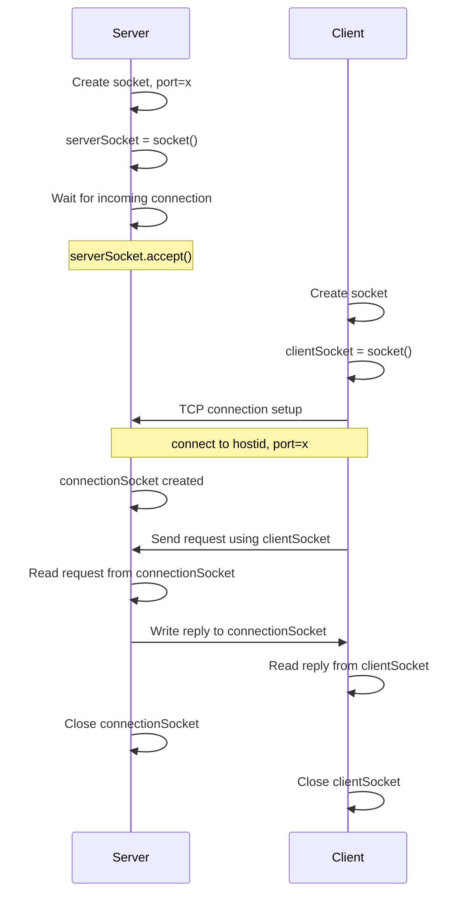
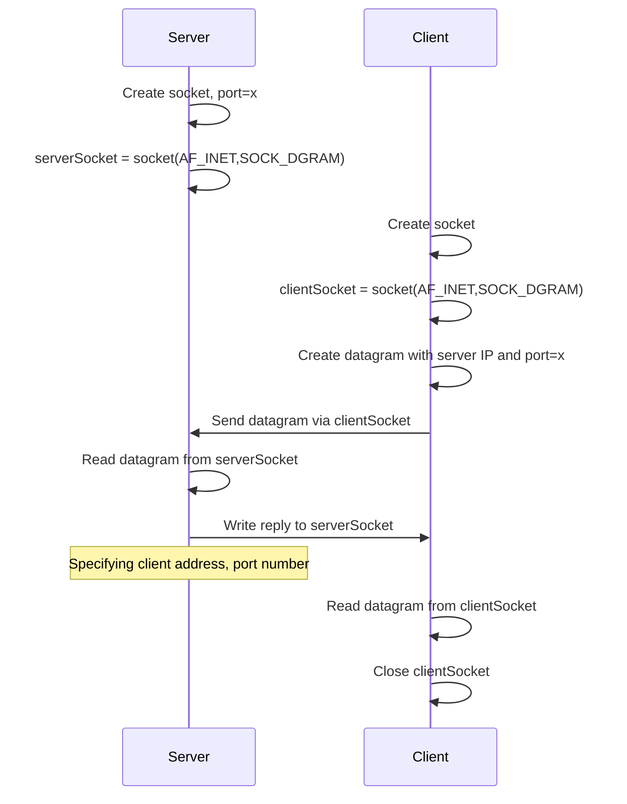

# CS-455 Socket Programming Study Notes

## Table of Contents
- [CS-455 Socket Programming Study Notes](#cs-455-socket-programming-study-notes)
  - [Table of Contents](#table-of-contents)
  - [Socket Programming Overview](#socket-programming-overview)
  - [Socket Fundamentals](#socket-fundamentals)
    - [Two Socket Types for Two Transport Services](#two-socket-types-for-two-transport-services)
    - [Application Example Used Throughout](#application-example-used-throughout)
  - [TCP Socket Programming](#tcp-socket-programming)
    - [TCP Characteristics](#tcp-characteristics)
    - [Client-Server Interaction in TCP](#client-server-interaction-in-tcp)
      - [Client Requirements](#client-requirements)
      - [Server Requirements](#server-requirements)
    - [TCP Connection Process Flow](#tcp-connection-process-flow)
    - [TCP Client Implementation](#tcp-client-implementation)
    - [TCP Server Implementation](#tcp-server-implementation)
  - [UDP Socket Programming](#udp-socket-programming)
    - [UDP Characteristics](#udp-characteristics)
    - [Client-Server Interaction in UDP](#client-server-interaction-in-udp)
    - [UDP Client Implementation](#udp-client-implementation)
    - [UDP Server Implementation](#udp-server-implementation)
  - [Complete Code Examples](#complete-code-examples)
    - [TCP Client-Server Pair](#tcp-client-server-pair)
    - [UDP Client-Server Pair](#udp-client-server-pair)
  - [Key Differences Between TCP and UDP](#key-differences-between-tcp-and-udp)
  - [Important Notes for Implementation](#important-notes-for-implementation)
    - [Port Number Selection](#port-number-selection)
    - [Python Socket Programming Details](#python-socket-programming-details)
    - [Error Handling Considerations](#error-handling-considerations)

---

## Socket Programming Overview

**Goal**: Learn how to build client/server applications that communicate using sockets.

A **socket** is the door between an application process and the end-to-end transport protocol. It serves as the interface between:
- The application layer (controlled by the app developer)
- The transport layer (controlled by the OS)

```mermaid
graph LR
    subgraph "Host 1"
        A1[Application Process] --> S1[Socket]
        S1 --> T1[Transport Layer]
        T1 --> N1[Network Layer]
        N1 --> L1[Link Layer]
        L1 --> P1[Physical Layer]
    end
    
    subgraph "Internet"
        I[Network Infrastructure]
    end
    
    subgraph "Host 2"
        P2[Physical Layer] --> L2[Link Layer]
        L2 --> N2[Network Layer]
        N2 --> T2[Transport Layer]
        T2 --> S2[Socket]
        S2 --> A2[Application Process]
    end
    
    P1 -.-> I -.-> P2
```



## Socket Fundamentals

### Two Socket Types for Two Transport Services

1. **TCP Socket**: Reliable, byte stream-oriented communication
2. **UDP Socket**: Unreliable datagram communication

### Application Example Used Throughout

The slides demonstrate a simple client-server application that:
1. Client reads a line of characters (data) from its keyboard and sends data to server
2. Server receives the data and converts characters to uppercase
3. Server sends modified data to client
4. Client receives modified data and displays line on its screen

---

## TCP Socket Programming

### TCP Characteristics

**TCP provides reliable, in-order byte-stream transfer** ("pipe") between client and server from an application viewpoint.

Key features of TCP:
- Connection-oriented protocol
- Reliable data transfer
- In-order delivery
- Byte stream abstraction

### Client-Server Interaction in TCP

#### Client Requirements
- **Server process must first be running** before client attempts connection
- **Server must have created socket** (door) that welcomes client's contact
- Client creates TCP socket specifying IP address and port number of server process
- When client creates socket, client TCP establishes connection to server TCP

#### Server Requirements
- When contacted by client, **server TCP creates new socket** for server process to communicate with that particular client
- This allows server to talk with multiple clients
- Source port numbers are used to distinguish clients

### TCP Connection Process Flow



### TCP Client Implementation

**Python TCP Client Code Structure:**

```python
from socket import *
serverName = '127.0.0.1'
serverPort = 1234
clientSocket = socket(AF_INET, SOCK_STREAM)
clientSocket.connect((serverName,serverPort))
sentence = input('Input lowercase sentence:')
clientSocket.send(sentence.encode())
modifiedSentence = clientSocket.recv(1024)
print ('From Server:', modifiedSentence.decode())
clientSocket.close()
```

**Key Points:**
- Creates TCP socket for server at remote port 1234
- `AF_INET` indicates IPv4
- `SOCK_STREAM` indicates TCP socket
- No need to attach server name and port to each message (connection-oriented)
- Uses `encode()` to convert string to bytes for transmission
- Uses `decode()` to convert received bytes back to string

### TCP Server Implementation

**Python TCP Server Code Structure:**

```python
from socket import *
serverName = '127.0.0.1'
serverPort = 1234
serverSocket = socket(AF_INET,SOCK_STREAM)
serverSocket.bind((serverName,serverPort))
serverSocket.listen(1)
print ('The server is ready to receive')
while True:
    connectionSocket, addr = serverSocket.accept()
    sentence = connectionSocket.recv(1024).decode()
    capitalizedSentence = sentence.upper()
    connectionSocket.send(capitalizedSentence.encode())
    connectionSocket.close()
```

**Key Points:**
- Creates TCP welcoming socket
- `bind()` associates the socket with a specific address and port
- `listen(1)` indicates server begins listening for incoming TCP requests
- Server waits on `accept()` for incoming requests
- New socket (`connectionSocket`) created on return for each client
- Reads bytes from socket (but not address as in UDP)
- Closes connection to client but not welcoming socket

---

## UDP Socket Programming

### UDP Characteristics

**UDP provides unreliable transfer** of groups of bytes ("datagrams") between client and server from an application viewpoint.

Key differences from TCP:
- **No "connection"** between client & server
- **No handshaking** before sending data
- Sender **explicitly attaches IP destination address and port #** to each packet
- Receiver **extracts sender IP address and port#** from received packet
- **Transmitted data may be lost or received out-of-order**

### Client-Server Interaction in UDP



### UDP Client Implementation

**Python UDP Client Code Structure:**

```python
from socket import *
serverName = '127.0.0.1'
serverPort = 12000
clientSocket = socket(AF_INET, SOCK_DGRAM)
message = input('Input lowercase sentence:')
clientSocket.sendto(message.encode(),(serverName, serverPort))
modifiedMessage, serverAddress = clientSocket.recvfrom(2048)
print(modifiedMessage.decode())
clientSocket.close()
```

**Key Points:**
- Creates UDP socket for server
- `SOCK_DGRAM` indicates UDP socket
- Must attach server name and port to message using `sendto()`
- `recvfrom()` returns both the message and the sender's address
- Buffer size of 2048 bytes specified in `recvfrom()`

### UDP Server Implementation

**Python UDP Server Code Structure:**

```python
from socket import *
serverName = '127.0.0.1'
serverPort = 12000
serverSocket = socket(AF_INET, SOCK_DGRAM)
serverSocket.bind((serverName, serverPort))
print ('The server is ready to receive')
while True:
    message, clientAddress = serverSocket.recvfrom(2048)
    modifiedMessage = message.decode().upper()
    serverSocket.sendto(modifiedMessage.encode(),clientAddress)
```

**Key Points:**
- Creates UDP socket
- Binds socket to local port number 12000
- Loops forever to handle multiple clients
- Reads from UDP socket into message, getting client's address (client IP and port)
- Sends upper case string back to specific client using their address

---

## Complete Code Examples

### TCP Client-Server Pair

The complete TCP implementation shows both client and server code side by side, demonstrating:
- Server creates welcoming socket and waits
- Client connects to server
- Bidirectional communication through established connection
- Connection closure after data exchange

### UDP Client-Server Pair

The complete UDP implementation shows:
- No connection establishment phase
- Each message must include addressing information
- Server extracts client address from received packets
- Server uses extracted address to send replies

---

## Key Differences Between TCP and UDP

| Aspect | TCP | UDP |
|--------|-----|-----|
| **Connection** | Connection-oriented (handshaking) | Connectionless |
| **Reliability** | Reliable, in-order delivery | Unreliable, may lose packets |
| **Socket Type** | SOCK_STREAM | SOCK_DGRAM |
| **Addressing** | Address specified once at connection | Address attached to each packet |
| **Server Sockets** | Creates new socket per client | Uses single socket for all clients |
| **Data Transfer** | Byte stream | Datagrams |
| **Methods** | send(), recv() | sendto(), recvfrom() |

---

## Important Notes for Implementation

### Port Number Selection
**Use any port number between 1025 and 65535 for your applications**
- Ports 0-1024 are reserved for well-known services
- Choose ports in the unreserved range for custom applications

### Python Socket Programming Details

1. **Import Statement**: `from socket import *` includes Python's socket library

2. **Socket Creation Parameters**:
   - First parameter: `AF_INET` for IPv4
   - Second parameter: `SOCK_STREAM` for TCP or `SOCK_DGRAM` for UDP

3. **String Encoding/Decoding**:
   - Use `.encode()` to convert strings to bytes before sending
   - Use `.decode()` to convert received bytes back to strings

4. **Buffer Sizes**:
   - TCP recv(): typically 1024 bytes
   - UDP recvfrom(): typically 2048 bytes

5. **Server Listening**:
   - TCP servers must call `listen()` after `bind()`
   - The parameter to `listen()` specifies the maximum number of queued connections

6. **Connection Management**:
   - TCP servers create a new socket for each client connection
   - UDP servers use the same socket for all clients
   - Always close sockets when done to free resources

### Error Handling Considerations

While not shown in the basic examples, production code should include:
- Exception handling for network errors
- Timeout handling for recv operations
- Validation of received data
- Proper resource cleanup in all code paths